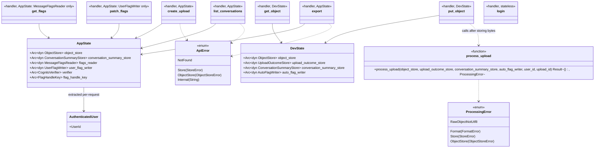

# timeline-api

The deployed backend: an `axum` app assembling routes over [`timeline-core`](../timeline-core/README.md)'s
domain logic and [`timeline-storage`](../timeline-storage/README.md)'s adapters, gated by
[`timeline-auth`](../timeline-auth/README.md)'s Cognito verification. `main.rs` is the single
entrypoint — it runs the same router either as a Lambda function
(behind API Gateway) or as a local dev server (`cargo run -p timeline-api`), based on whether
`AWS_LAMBDA_RUNTIME_API` is set.

**Dependencies**: `timeline-core`, `timeline-storage`, `timeline-auth`, `axum`, `tokio`,
`lambda_http`, `serde`/`serde_json`, `uuid`, `jsonwebtoken`, `tower-http` (CORS), `rsa`/`rand`/`base64`
(generating the dev-only signing keypair at runtime).

## Two routers, structurally separated

This crate builds **two different routers with two different state types**, not one router with
optional pieces:

- **`AppState`** ([src/state.rs](src/state.rs)) — the real, Cognito-gated API. Exposes each storage
  capability as its own `FromRef` implementation, so a route handler's function signature only ever
  names the one trait object it actually needs.
- **`DevState`** ([src/dev_state.rs](src/dev_state.rs)) — the `_dev`-namespaced local-testing
  surface. This is the **only** place `AutoFlagWriter` is reachable in this binary.

`main.rs` merges `DevState`'s router into the running server **only** in the local-dev branch — the
Lambda branch is handed `build_router(app_state)` alone and never even constructs the merge. So the
`_dev` routes (and the `AutoFlagWriter` capability) are structurally absent from anything that could
run in production, not a convention that could be forgotten.

## Routes

| Method & path | Handler | State |
|---|---|---|
| `POST /uploads` | [`routes::uploads::create_upload`](src/routes/uploads.rs) | `AppState` |
| `GET /conversations` | [`routes::conversations::list_conversations`](src/routes/conversations.rs) | `AppState` |
| `GET`/`PATCH /conversations/{id}/messages/{id}/flags` | [`routes::flags`](src/routes/flags.rs) | `AppState` (two *different* narrow states — see below) |
| `GET /export` | [`routes::export::export`](src/routes/export.rs) | `AppState` |
| `PUT`/`GET /_dev/local-storage/{put,get}/{*key}` | [`routes::dev_local_storage`](src/routes/dev_local_storage.rs) | `DevState`, local-dev only |
| `POST /_dev/login` | [`routes::dev_login::login`](src/routes/dev_login.rs) | none, local-dev only |

`GET`/`PATCH .../flags` are the concrete embodiment of the auto/user separation: the two handlers
are given *different* state types (`Arc<dyn MessageFlagsReader>` vs. `Arc<dyn UserFlagWriter>`), so
the `PATCH` handler's own source code has no `AutoFlagWriter` in scope at all — not "doesn't call
it," genuinely not a parameter it could call.

**Flag handles** ([`flag_handles`](src/flag_handles.rs), migration plan §V2c). `GET /export` replies
with `{"export_url": ..., "flag_handles": {"<message id>": "<handle>"}}`: one handle per user
message, an HMAC-SHA256 signature over the user, conversation and message ids under a key only the
server holds. The exported `conversations.json` itself carries no handles. `PATCH .../flags` takes
`{"handle": ..., "caps"?, "critical"?, "angry"?}` and answers:

- **400** for an unknown field (named in the message), a missing `handle`, or nothing to change;
- **403** when the handle doesn't match the conversation and message in the address;
- **200** with the stored record otherwise.

So a save can only name a message the server actually sent.

**Two ways to build `AppState`.** Local dev (`main.rs`'s `build_local_state`) uses the in-memory
stores and the throwaway dev login keys. The Lambda uses
[`aws_state::build_aws_state`](src/aws_state.rs): the S3 and DynamoDB adapters, and a
`CognitoVerifier` loaded with the user pool's published keys, from settings read once by
[`aws_settings::AwsSettings`](src/aws_settings.rs). A missing setting, flag-handle key or key
download stops the Lambda at startup; nothing falls back to the local setup. See the migration
plan's §V2d. The key is generated at startup
locally; on Lambda it comes from `TIMELINE_FLAG_HANDLE_KEY` (filled from Secrets Manager by
[infra/template.yaml](../../infra/template.yaml)), and the Lambda refuses to start without it.

## Processing: composing timeline-core logic with the ports

[`processing::process_upload`](src/processing.rs) turns a raw upload into stored conversation
summaries and auto flags. It contains **no new domain logic** — it composes already-tested
`timeline-core` functions (`unwrap_uploaded_json`, the three flag detectors) with the storage ports,
generic over the trait objects so it's callable by either a real S3-triggered Lambda (not yet
built) or the local-dev `PUT /_dev/local-storage/...` handler (which calls it directly as a
stand-in for the real S3 event — see the migration plan's §V2a).

## Test coverage

163+ tests across the workspace exercise this crate through real HTTP requests
(`tower::ServiceExt::oneshot` against the actual `Router`, not a mock) — [tests/app.rs](tests/app.rs),
[tests/dev_routes.rs](tests/dev_routes.rs), [tests/export.rs](tests/export.rs),
[tests/processing.rs](tests/processing.rs), [tests/flag_saves.rs](tests/flag_saves.rs),
[tests/aws_state.rs](tests/aws_state.rs). Additionally verified with a real, driven headless
browser via the top-level [`e2e/`](../../e2e/README.md) Playwright suite — uploading a real file
through the real local-dev server and confirming it renders in `timeline.html`.

Auth material for tests and local dev (`timeline_api::dev_only::DEV_KEYPAIR`) is a throwaway RSA
keypair **generated fresh at runtime**, never written to disk or checked into git — see
[src/dev_only.rs](src/dev_only.rs)'s module doc for why an earlier, checked-in-PEM-file design was
changed.

## Class diagram

