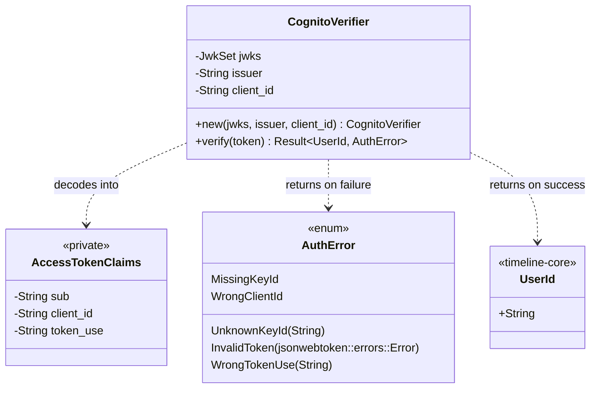

# timeline-auth

Verifies an AWS Cognito **access token** (not an ID token — access tokens are what a route handler
should check, since they carry authorization for calling an API; see the migration plan §1.4). One
public type, `CognitoVerifier`, one method, `verify`.

**Dependencies**: `timeline-core` (for `UserId`), `jsonwebtoken` (RSA/JWK signature verification),
`serde`. Dev-only: `serde_json`, `rsa`, `rand`, `base64` (generating a throwaway test keypair at
runtime — see below).

## Why access tokens, not ID tokens, and why `client_id` not `aud`

Cognito access tokens carry `client_id` and `token_use: "access"`, not the generic `aud` (audience)
claim most JWT libraries expect — `jsonwebtoken`'s built-in audience validation doesn't know this
Cognito-specific shape, so `CognitoVerifier::verify` disables it (`validation.validate_aud = false`)
and checks `client_id`/`token_use` manually instead ([src/cognito.rs:89-105](src/cognito.rs#L89-L105)).

## What's deliberately not built yet

Fetching and caching a user pool's JWKS (JSON Web Key Set) from its real
`.well-known/jwks.json` endpoint over HTTP is not implemented — `CognitoVerifier::new` takes an
already-loaded `JwkSet`, so the verification logic is fully testable with a self-signed key without
needing a real Cognito pool or network access. A real deployment needs a thin wrapper that fetches
and periodically refreshes the JWKS; see [src/lib.rs](src/lib.rs)'s module doc.

## Test coverage

**97.37% line coverage**, 10 real tests
([tests/cognito.rs](tests/cognito.rs)), all against a throwaway RSA keypair generated fresh at test
runtime (not checked into git — see the migration plan's discussion of why a checked-in key, even a
fake one, is a bad idea). Covers: a valid token verifying to the right user, wrong `client_id`,
wrong `token_use`, an unknown signing key, wrong issuer, an expired token, garbage input, every
`AuthError` variant's `Display` message, `InvalidToken`'s preserved source error, and a malformed
JWK being rejected as an error rather than panicking.

**What this does *not* cover, and can't without AWS access**: verification against a real Cognito
user pool's actual tokens. Only a self-signed stand-in has ever been checked — see
[backend/README.md](../README.md)'s "What's actually been verified" section. This is a real,
disclosed gap, not a process failure — it needs AWS account access neither this environment nor
this session has been given, the same blocker as `timeline-storage`'s untested real adapters.

## Class diagram

