# timeline-core

Pure domain logic for the conversation-timeline tool: **no I/O, no AWS SDK, no HTTP.** A tested
Rust port of the non-presentation logic that used to live entirely in `timeline.html`'s inline
`<script>` — parsing, deduplication, session-splitting, flag heuristics, and the "ports" (traits)
every other crate implements or depends on. See
[docs/plans/2026-09-09-rust-aws-backend-migration.md](../../docs/plans/2026-09-09-rust-aws-backend-migration.md)
for the architecture this crate is part of.

**Dependencies**: `serde`/`serde_json` (data model), `chrono` (timestamps), `regex` (criticism/anger
keyword matching), `uuid` (identity types), `async-trait` (the ports). No AWS SDK, no HTTP client —
by design, so this crate can be unit-tested and reasoned about with nothing but `cargo test`, and
so an infrastructure crate (`timeline-storage`) could be swapped out without this crate or its
tests changing at all.

**Test coverage**: 100% line/function/region, using only public-API tests (`cargo llvm-cov -p
timeline-core --summary-only` to verify).

## Modules

| Module | Responsibility |
|---|---|
| [`model`](src/model.rs) | The typed export schema: `Conversation`, `ChatMessage`, `ContentPiece`, and the newtypes/enums (`ConversationId`, `MessageId`, `Sender`, `PieceType`, `ConversationName`) that replace bare strings at the parse boundary. |
| [`format`](src/format.rs) | `unwrap_uploaded_json`/`unwrap_uploaded_value` — accepts either a raw export (bare array) or a previously-processed file (`{"conversations": [...]}`), matching the original `unwrapUploadedJSON`. |
| [`dedup`](src/dedup.rs) | `dedup_chat_messages`/`dedup_conversations` — removes retried duplicate human messages. |
| [`sessions`](src/sessions.rs) | `build_blocks` — gap-based session splitting (UTC in, UTC out; day-bucketing stays client-side, see the module doc). |
| [`flags`](src/flags.rs) | Three independent detectors — `caps::has_emphasis_caps` (dictionary-checked ALL-CAPS), `criticism::detect_critical` (keyword regex), `anger::detect_angry` (VADER + phrase list + exclamation bursts) — plus `matrix::effective_flag`, the four-state auto/user visibility logic. |
| [`flag_values`](src/flag_values.rs) | One message's flag values: the automatic ones and yours, kept apart so the scan can never overwrite yours. |
| [`flag_view`](src/flag_view.rs) | The page's two show switches as one value, and what a message counts as under them. |
| [`labels`](src/labels.rs) | Short typed labels (participant, AI, transcription service, file name), each its own newtype. |
| [`conversation_metadata`](src/conversation_metadata.rs) | What a conversation's messages don't say: who took part, how it was held, its span, its source file. |
| [`message_time`](src/message_time.rs) | A message's time, which may be unknown (stored as the 1970-01-01 sentinel). |
| [`branches`](src/branches.rs) | Prunes the branches a later message replaced; a conversation with any unknown time is left whole. |
| [`keep`](src/keep.rs) | What is kept of one parsed conversation: its kept path as rows, notes for replaced branches, branches important enough to be conversations of their own. |
| [`kept_files`](src/kept_files.rs) | The files a conversation's export holds (presented files, widgets, attachments). |
| [`merge`](src/merge.rs) | What a later file adds to a conversation already stored, including a revived branch. |
| [`stored_message`](src/stored_message.rs) | A message or note row as stored. |
| [`stored_session`](src/stored_session.rs) | A session as stored, with its placement and fourteen counts. |
| [`message_filter`](src/message_filter.rs) | Review's filters as one value, shared by every route that reads messages. |
| [`server_analyses`](src/server_analyses.rs) | The flag rate over time and by hour and weekday, computed from each message's own time. |
| [`walk_cursor`](src/walk_cursor.rs) | Where a walk over the user's messages stopped, so the next part resumes there. |
| [`work_budget`](src/work_budget.rs) | How much work one request may do before it answers (a clock in production, a step count in tests). |
| [`vader`](src/vader.rs) | A faithful Rust port of the VADER sentiment algorithm (`polarity_scores`), replacing the original's AFINN lexicon for license reasons (ODbL vs. this project's permissive-only policy — see the migration plan's C2). |
| [`ports`](src/ports.rs) | Trait definitions every infrastructure crate implements against — see below. |

## Ports: what "ports and adapters" means here

A **port** is a trait this crate defines for something it needs from the outside world (blob
storage, a database) without depending on any concrete technology. An **adapter** (in
[`timeline-storage`](../timeline-storage/README.md)) is a concrete implementation of a port for one
specific technology (S3, DynamoDB, an in-memory fake). This crate only ever depends on the trait;
it never imports an AWS SDK type. That's what makes an adapter swappable without touching this
crate or its tests — a Postgres-backed adapter could replace DynamoDB with zero changes here.

| Port | Purpose |
|---|---|
| [`ObjectStore`](src/ports/object_store.rs) | Presigned-URL blob storage (S3-shaped): `presign_put`/`presign_get`/`get`/`put`/`delete`. Holds raw uploads (deleted once processed) and the files kept from conversations (`file_object_key`). |
| [`UploadOutcomeStore`](src/ports/uploads.rs) | One upload's outcome, its attempts and how far processing has got (`record_processing_progress`), and what `POST /uploads` learned about the file. The raw object's key is a pure function of `(user_id, upload_id)` (`raw_object_key`), never stored. |
| [`ConversationSummaryStore`](src/ports/conversations.rs) | Conversation records: `list_for_user`/`list_page`/`get` (read), `put` (a versioned write, refused with `Conflict` when someone else wrote first). |
| [`MessageReader`](src/ports/messages.rs) | Message and note rows: a session's range, a message by id, the row after a message. |
| [`MessageRowWriter`](src/ports/messages.rs) | Whole-row writes and deletes — held only by upload processing. |
| [`AutoFlagWriter`](src/ports/messages.rs) | Write access to *only* the automatic flags on a row — held by the scan. |
| [`UserFlagWriter`](src/ports/messages.rs) | Write access to *only* your flags on a row — held by the `PATCH .../flags` route. |
| [`SessionStore`](src/ports/sessions.rs) | Sessions with their fourteen counts, in key order. |
| [`UserRecordStore`](src/ports/user_record.rs) | The user's data version and totals. |
| [`AnalysisStore`](src/ports/analyses.rs) | Saved results of the two server analyses. |

The split on message flags is deliberate, not incidental: it's what makes the auto/user
separation ([timeline-project-decisions.md §2.6](../../timeline-project-decisions.md#L98)) a
compile-time guarantee rather than a convention — a route handler holding a `UserFlagWriter` has no
way to call anything that would touch an automatic value, because no such method exists on the
type it holds. See [timeline-api/README.md](../timeline-api/README.md) for how the wiring layer
carries this through.

## Class diagram

```mermaid
classDiagram
    class Conversation {
        +ConversationId uuid
        +ConversationName name
        +Vec~ChatMessage~ chat_messages
    }
    class ChatMessage {
        +MessageId uuid
        +String text
        +Vec~ContentPiece~ content
        +Sender sender
        +DateTime~Utc~ created_at
    }
    class ContentPiece {
        +PieceType piece_type
        +String text
    }
    class Sender {
        <<enum>>
        Human
        Assistant
        Other(String)
    }
    class PieceType {
        <<enum>>
        Text
        Other(String)
    }
    Conversation "1" *-- "many" ChatMessage
    ChatMessage "1" *-- "many" ContentPiece
    ChatMessage --> Sender
    ContentPiece --> PieceType

    class ObjectStore {
        <<trait>>
        +presign_put(key, expires_in) String
        +presign_get(key, expires_in) String
        +get(key) Vec~u8~
        +put(key, data)
        +delete(key)
    }
    class UploadOutcomeStore {
        <<trait>>
        +record_outcome(user_id, upload_id, outcome)
        +get_outcome(user_id, upload_id) UploadOutcome?
    }
    class ConversationSummaryStore {
        <<trait>>
        +list_for_user(user_id) Vec~ConversationSummary~
        +list_page(user_id, after, limit) Vec~ConversationSummary~
        +get(user_id, conversation_id) ConversationSummary?
        +put(user_id, summary) ConversationSummary
    }
    class MessageReader {
        <<trait>>
        +read_entries(user_id, range) Vec~Entry~
        +find_entry(user_id, conversation_id, message_id) Entry?
        +entry_after(user_id, key) Entry?
    }
    class MessageRowWriter {
        <<trait>>
        +put_entries(user_id, entries)
        +delete_entries(user_id, keys)
    }
    class AutoFlagWriter {
        <<trait>>
        +set_auto_flags(user_id, key, flags)
    }
    class UserFlagWriter {
        <<trait>>
        +set_user_flags(user_id, key, overrides) MessageFlags
    }
    class UploadOutcome {
        <<enum>>
        Ready(conversation_ids)
        Failed(reason)
    }
    class ConversationSummary {
        +ConversationId conversation_id
        +UploadId upload_id
        +ConversationName name
        +usize message_count
    }
    class MessageFlags {
        +FlagSet? auto
        +FlagOverrides user
    }
    class FlagSet {
        +bool caps
        +bool critical
        +bool angry
    }
    class FlagOverrides {
        +Option~bool~ caps
        +Option~bool~ critical
        +Option~bool~ angry
    }
    UploadOutcomeStore ..> UploadOutcome
    ConversationSummaryStore ..> ConversationSummary
    UserFlagWriter ..> MessageFlags
    MessageFlags --> FlagSet
    MessageFlags --> FlagOverrides
```

