# timeline-core

Pure domain logic for the conversation-timeline tool: **no I/O, no AWS SDK, no HTTP.** A tested
Rust port of the non-presentation logic that used to live entirely in `timeline.html`'s inline
`<script>` — parsing, deduplication, session-splitting, flag heuristics, and the "ports" (traits)
every other crate implements or depends on. See
[docs/plans/2026-09-09-rust-aws-backend-migration.md](../../docs/plans/2026-09-09-rust-aws-backend-migration.md)
for the architecture this crate is part of.

**Dependencies**: `serde`/`serde_json` (data model), `chrono` (timestamps), `regex` (criticism/anger
keyword matching), `uuid` (identity types), `async-trait` (the ports). No AWS SDK, no HTTP client —
by design, so this crate can be unit-tested and reasoned about with nothing but `cargo test`, and
so an infrastructure crate (`timeline-storage`) could be swapped out without this crate or its
tests changing at all.

**Test coverage**: 100% line/function/region, using only public-API tests (`cargo llvm-cov -p
timeline-core --summary-only` to verify).

## Modules

| Module | Responsibility |
|---|---|
| [`model`](src/model.rs) | The typed export schema: `Conversation`, `ChatMessage`, `ContentPiece`, and the newtypes/enums (`ConversationId`, `MessageId`, `Sender`, `PieceType`, `ConversationName`) that replace bare strings at the parse boundary. |
| [`format`](src/format.rs) | `unwrap_uploaded_json`/`unwrap_uploaded_value` — accepts either a raw export (bare array) or a previously-processed file (`{"conversations": [...]}`), matching the original `unwrapUploadedJSON`. |
| [`dedup`](src/dedup.rs) | `dedup_chat_messages`/`dedup_conversations` — removes retried duplicate human messages. |
| [`sessions`](src/sessions.rs) | `build_blocks` — gap-based session splitting (UTC in, UTC out; day-bucketing stays client-side, see the module doc). |
| [`flags`](src/flags.rs) | Three independent detectors — `caps::has_emphasis_caps` (dictionary-checked ALL-CAPS), `criticism::detect_critical` (keyword regex), `anger::detect_angry` (VADER + phrase list + exclamation bursts) — plus `matrix::effective_flag`, the four-state auto/user visibility logic. |
| [`vader`](src/vader.rs) | A faithful Rust port of the VADER sentiment algorithm (`polarity_scores`), replacing the original's AFINN lexicon for license reasons (ODbL vs. this project's permissive-only policy — see the migration plan's C2). |
| [`ports`](src/ports.rs) | Trait definitions every infrastructure crate implements against — see below. |

## Ports: what "ports and adapters" means here

A **port** is a trait this crate defines for something it needs from the outside world (blob
storage, a database) without depending on any concrete technology. An **adapter** (in
[`timeline-storage`](../timeline-storage/README.md)) is a concrete implementation of a port for one
specific technology (S3, DynamoDB, an in-memory fake). This crate only ever depends on the trait;
it never imports an AWS SDK type. That's what makes an adapter swappable without touching this
crate or its tests — a Postgres-backed adapter could replace DynamoDB with zero changes here.

| Port | Purpose |
|---|---|
| [`ObjectStore`](src/ports/object_store.rs) | Presigned-URL blob storage (S3-shaped): `presign_put`/`presign_get`/`get`/`put`. |
| [`UploadOutcomeStore`](src/ports/uploads.rs) | One upload's terminal outcome, written once when processing finishes: `record_outcome`/`get_outcome`. No pending/processing state — nothing reads it (see the migration plan's §V2a-revision). The raw object's key is a pure function of `(user_id, upload_id)` (`raw_object_key`), never stored. |
| [`ConversationSummaryStore`](src/ports/conversations.rs) | Conversation summaries: `list_for_user`/`get` (read), `put` (write — used only by the upload-processing pipeline). |
| [`MessageFlagsReader`](src/ports/message_flags.rs) | Read access to a message's auto + user flags. |
| [`AutoFlagWriter`](src/ports/message_flags.rs) | Write access to *only* auto-detected flags — held exclusively by the processing pipeline. |
| [`UserFlagWriter`](src/ports/message_flags.rs) | Write access to *only* the user's own overrides — held exclusively by the `PATCH .../flags` route. |

The three-way split on message flags is deliberate, not incidental: it's what makes the auto/user
separation ([timeline-project-decisions.md §2.6](../../timeline-project-decisions.md#L98)) a
compile-time guarantee rather than a convention — a route handler holding a `UserFlagWriter` has no
way to call anything that would touch an auto-detected value, because no such method exists on the
type it holds. See [timeline-api/README.md](../timeline-api/README.md) for how the wiring layer
carries this through.

## Class diagram

```mermaid
classDiagram
    class Conversation {
        +ConversationId uuid
        +ConversationName name
        +Vec~ChatMessage~ chat_messages
    }
    class ChatMessage {
        +MessageId uuid
        +String text
        +Vec~ContentPiece~ content
        +Sender sender
        +DateTime~Utc~ created_at
    }
    class ContentPiece {
        +PieceType piece_type
        +String text
    }
    class Sender {
        <<enum>>
        Human
        Assistant
        Other(String)
    }
    class PieceType {
        <<enum>>
        Text
        Other(String)
    }
    Conversation "1" *-- "many" ChatMessage
    ChatMessage "1" *-- "many" ContentPiece
    ChatMessage --> Sender
    ContentPiece --> PieceType

    class ObjectStore {
        <<trait>>
        +presign_put(key, expires_in) String
        +presign_get(key, expires_in) String
        +get(key) Vec~u8~
        +put(key, data)
    }
    class UploadOutcomeStore {
        <<trait>>
        +record_outcome(user_id, upload_id, outcome)
        +get_outcome(user_id, upload_id) UploadOutcome?
    }
    class ConversationSummaryStore {
        <<trait>>
        +list_for_user(user_id) Vec~ConversationSummary~
        +get(user_id, conversation_id) ConversationSummary?
        +put(user_id, summary)
    }
    class MessageFlagsReader {
        <<trait>>
        +get(user_id, conversation_id, message_id) MessageFlagRecord?
        +list_for_conversation(user_id, conversation_id) Vec~MessageFlagRecord~
    }
    class AutoFlagWriter {
        <<trait>>
        +set_auto_flags(user_id, conversation_id, message_id, flags)
    }
    class UserFlagWriter {
        <<trait>>
        +set_user_flags(user_id, conversation_id, message_id, overrides) MessageFlagRecord
    }
    class UploadOutcome {
        <<enum>>
        Ready(conversation_ids)
        Failed(reason)
    }
    class ConversationSummary {
        +ConversationId conversation_id
        +UploadId upload_id
        +ConversationName name
        +usize message_count
    }
    class MessageFlagRecord {
        +MessageId message_id
        +FlagSet auto
        +FlagOverrides user
    }
    class FlagSet {
        +bool caps
        +bool critical
        +bool angry
    }
    class FlagOverrides {
        +Option~bool~ caps
        +Option~bool~ critical
        +Option~bool~ angry
    }
    UploadOutcomeStore ..> UploadOutcome
    ConversationSummaryStore ..> ConversationSummary
    MessageFlagsReader ..> MessageFlagRecord
    UserFlagWriter ..> MessageFlagRecord
    MessageFlagRecord --> FlagSet
    MessageFlagRecord --> FlagOverrides
```

