# timeline-storage

Concrete adapters implementing [`timeline-core`](../timeline-core/README.md)'s storage ports — see
that crate's README for what a "port" and an "adapter" mean here. Two families:

- **`memory`** — in-memory fakes (`Arc<Mutex<HashMap>>`), used by `timeline-api`'s own tests and by
  the local-dev server (`cargo run -p timeline-api`) to avoid any AWS/container dependency.
- **`s3`/`dynamo`** — the real AWS-backed adapters, for an eventual real deployment.

**Dependencies**: `timeline-core`, `async-trait`, `tokio`, `aws-sdk-s3`, `aws-sdk-dynamodb`,
`aws-smithy-types`, `uuid`, `serde_json`.

## Why this crate exists already, ahead of any real AWS deployment

Built during an earlier phase of this project's Rust migration (when the instruction was to build
the full V2 backend design), before this repo settled on staying container-free/AWS-free for
routine local testing (see the migration plan's §V2a). The real adapters compile against the
actual `aws-sdk-s3`/`aws-sdk-dynamodb` types, proving the port traits are shaped correctly for a
real implementation. Since the migration plan's §V2b they run against local stand-ins (`s3s-fs` for
S3, Amazon's DynamoDB Local for DynamoDB), but **they have never been run against real AWS.** The
in-memory adapters, built alongside them, are what every other crate's tests and the local-dev
server actually exercise.

## Test coverage — the honest split

Measured directly on 2026-10-06 (`cargo llvm-cov --workspace --summary-only`), not
estimated. Each storage interface has one **contract suite** in [tests/support/](tests/support/):
checks any correct implementation must pass, run against both the in-memory fake
([tests/contract_memory.rs](tests/contract_memory.rs)) and the real adapter, so a fake that drifts
from the real service fails a test.

| File | Line coverage | What's actually tested |
|---|---|---|
| [`s3.rs`](src/s3.rs) | 100% | `ObjectStore` contract against `s3s-fs`; presigned PUT/GET used by a plain HTTP client; tampered, expired and wrong-method URLs rejected; over-long presign and an unreachable server reported as `Backend`. |
| [`dynamo/conversations_table.rs`](src/dynamo/conversations_table.rs) | 97.99% | `UploadOutcomeStore` (outcomes, attempts, processing progress, received facts) and `ConversationSummaryStore` (versioned writes, pages) contracts against DynamoDB Local; malformed rows; missing table. Unreached: commented, currently unreachable backstops. |
| [`dynamo/message_rows.rs`](src/dynamo/message_rows.rs) | 98.76% | Message-row contract (flags on rows, the auto/user separation read back through the real trait methods, ranges, reading after a key, finding by id) against DynamoDB Local; keys and entries our code didn't write; each flag attribute of the wrong type; a missing table; a conversation larger than one 1 MB answer. |
| [`dynamo/batches.rs`](src/dynamo/batches.rs) | 100% | Up to 16 batches of 25 at once; unfinished rows resent and, after five tries, reported by count — against a stand-in DynamoDB that hands rows back unfinished (DynamoDB Local never does). |
| [`dynamo/sessions_table.rs`](src/dynamo/sessions_table.rs), [`dynamo/user_record_rows.rs`](src/dynamo/user_record_rows.rs) | 98.90%, 98.61% | Session, user-record and saved-analysis contracts; rows our code didn't write; a missing table. |
| `memory/*.rs` | 100% (whole workspace) | Contract suites plus the `memory_*.rs` tests; each `Resettable::reset` is exercised through `timeline-api`'s `POST /_dev/reset` tests. |

Not covered by the stand-ins: real S3's host-name bucket addressing and its `NoSuchBucket` error
(`s3s-fs` 0.17 doesn't check bucket existence on `GetObject`/`PutObject`). Those wait for the
real-AWS run in the migration plan's §V2.

## Design: what each adapter is adapting, and how

- **`InMemoryObjectStore`/`InMemoryUploadOutcomeStore`/`InMemoryConversationSummaryStore`/`InMemoryMessageStore`/`InMemorySessionStore`/`InMemoryUserRecordStore`**
  — each wraps a `Mutex` around a map (ordered where the port promises key order). `InMemoryObjectStore`'s presigned URLs are real, relative
  HTTP paths (`/_dev/local-storage/put|get/{key}`) that `timeline-api`'s `_dev`-only routes serve —
  not an inert placeholder string — so a real browser can actually `PUT`/`GET` against them in local
  dev (see the migration plan's §V2a).
- **`S3ObjectStore`** implements `ObjectStore` against a real `aws_sdk_s3::Client`, using
  `PresigningConfig::expires_in` for `presign_put`/`presign_get`.
- **`DynamoConversationsTable`** implements *both* `UploadOutcomeStore` and `ConversationSummaryStore`
  against one DynamoDB table (`Conversations`) — a standard single-table-design pattern,
  distinguishing an upload's own terminal-outcome row (written once, by `record_outcome` — see the
  migration plan's §V2a-revision) from the conversation summaries it eventually produces by
  sort-key prefix (`UPLOAD#<id>` vs. `CONV#<id>`).
- **`DynamoMessageStore`**, **`DynamoSessionStore`** and **`DynamoUserRecordStore`** keep message
  rows (`MSG#{conversation}#{time}#{id}`), sessions (`SESS#{conversation}#{number}`), the user's
  record (`USER`) and saved analyses (`ANALYSIS#…`) in the same table (plan
  `docs/plans/2026-10-06-load-only-what-the-page-shows.md` §3). Flags live on the message rows in
  disjoint `auto_*`/`user_*` attribute names — the storage-level enforcement of the auto/user
  separation, verified by the message-row contract suite reading back what each kind of write
  stored, against DynamoDB Local. Every query pages past DynamoDB's 1 MB per answer.

## Class diagram

```mermaid
classDiagram
    class ObjectStore {
        <<trait, timeline-core>>
    }
    class UploadOutcomeStore {
        <<trait, timeline-core>>
    }
    class ConversationSummaryStore {
        <<trait, timeline-core>>
    }
    class MessageReader {
        <<trait, timeline-core>>
    }
    class MessageRowWriter {
        <<trait, timeline-core>>
    }
    class AutoFlagWriter {
        <<trait, timeline-core>>
    }
    class UserFlagWriter {
        <<trait, timeline-core>>
    }
    class SessionStore {
        <<trait, timeline-core>>
    }
    class UserRecordStore {
        <<trait, timeline-core>>
    }
    class AnalysisStore {
        <<trait, timeline-core>>
    }

    ObjectStore <|.. InMemoryObjectStore
    ObjectStore <|.. S3ObjectStore
    UploadOutcomeStore <|.. InMemoryUploadOutcomeStore
    UploadOutcomeStore <|.. DynamoConversationsTable
    ConversationSummaryStore <|.. InMemoryConversationSummaryStore
    ConversationSummaryStore <|.. DynamoConversationsTable
    MessageReader <|.. InMemoryMessageStore
    MessageRowWriter <|.. InMemoryMessageStore
    AutoFlagWriter <|.. InMemoryMessageStore
    UserFlagWriter <|.. InMemoryMessageStore
    MessageReader <|.. DynamoMessageStore
    MessageRowWriter <|.. DynamoMessageStore
    AutoFlagWriter <|.. DynamoMessageStore
    UserFlagWriter <|.. DynamoMessageStore
    SessionStore <|.. InMemorySessionStore
    SessionStore <|.. DynamoSessionStore
    UserRecordStore <|.. InMemoryUserRecordStore
    UserRecordStore <|.. DynamoUserRecordStore
    AnalysisStore <|.. InMemoryUserRecordStore
    AnalysisStore <|.. DynamoUserRecordStore
```

