# timeline-storage

Concrete adapters implementing [`timeline-core`](../timeline-core/README.md)'s storage ports — see
that crate's README for what a "port" and an "adapter" mean here. Two families:

- **`memory`** — in-memory fakes (`Arc<Mutex<HashMap>>`), used by `timeline-api`'s own tests and by
  the local-dev server (`cargo run -p timeline-api`) to avoid any AWS/container dependency.
- **`s3`/`dynamo`** — the real AWS-backed adapters, for an eventual real deployment.

**Dependencies**: `timeline-core`, `async-trait`, `tokio`, `aws-sdk-s3`, `aws-sdk-dynamodb`,
`aws-smithy-types`, `uuid`, `serde_json`.

## Why this crate exists already, ahead of any real AWS deployment

Built during an earlier phase of this project's Rust migration (when the instruction was to build
the full V2 backend design), before this repo settled on staying container-free/AWS-free for
routine local testing (see the migration plan's §V2a). The real adapters compile against the
actual `aws-sdk-s3`/`aws-sdk-dynamodb` types, proving the port traits are shaped correctly for a
real implementation — but **have never been run against real AWS or LocalStack.** The in-memory
adapters, built alongside them, are what every other crate's tests and the local-dev server
actually exercise.

## Test coverage — the honest split

Measured directly (`cargo llvm-cov -p timeline-storage --summary-only`), not estimated:

| File | Line coverage | What's actually tested |
|---|---|---|
| [`memory/object_store.rs`](src/memory/object_store.rs) | 100% | Full black-box tests via the real `ObjectStore` trait. |
| [`memory/uploads.rs`](src/memory/uploads.rs) | 100% | Full black-box tests via the real `UploadOutcomeStore` trait. |
| [`memory/conversations.rs`](src/memory/conversations.rs) | 100% | Full black-box tests via the real `ConversationSummaryStore` trait. |
| [`memory/message_flags.rs`](src/memory/message_flags.rs) | 100% | Full black-box tests via all three flag traits, including that auto/user writes never cross-contaminate. |
| [`dynamo/message_flags_table.rs`](src/dynamo/message_flags_table.rs) | 63.79% | Only the pure `UpdateExpression`-building logic (`auto_update_expression`/`user_update_expression`), via temporary private-function tests per this repo's CLAUDE.md exception. Every real `send()` call to DynamoDB is untested. |
| [`dynamo/conversations_table.rs`](src/dynamo/conversations_table.rs) | **0%** | No tests of any kind — not even private-function ones. |
| [`s3.rs`](src/s3.rs) | **0%** | No tests. Its own doc comment previously claimed it was "unit-testable for its own key-naming logic" — that was inaccurate and has been corrected; there's no key-naming logic in this file to test (keys are passed in by the caller). |

Closing the `dynamo`/`s3` gap needs either real AWS credentials or a local emulator. Researched,
not yet built (see the migration plan's C10): **DynamoDB** has a genuinely Docker-free path — AWS's
own "DynamoDB Local," a downloadable JAR needing only a JRE, no container. **S3** doesn't have an
equally clean answer yet — MinIO's licensing has shifted to a commercial product since it was last
checked; other options (e.g. `s3rver`, MIT-licensed) are unverified candidates.

## Design: what each adapter is adapting, and how

- **`InMemoryObjectStore`/`InMemoryUploadOutcomeStore`/`InMemoryConversationSummaryStore`/`InMemoryMessageFlagsStore`**
  — each wraps a `Mutex<HashMap<...>>`. `InMemoryObjectStore`'s presigned URLs are real, relative
  HTTP paths (`/_dev/local-storage/put|get/{key}`) that `timeline-api`'s `_dev`-only routes serve —
  not an inert placeholder string — so a real browser can actually `PUT`/`GET` against them in local
  dev (see the migration plan's §V2a).
- **`S3ObjectStore`** implements `ObjectStore` against a real `aws_sdk_s3::Client`, using
  `PresigningConfig::expires_in` for `presign_put`/`presign_get`.
- **`DynamoConversationsTable`** implements *both* `UploadOutcomeStore` and `ConversationSummaryStore`
  against one DynamoDB table (`Conversations`) — a standard single-table-design pattern,
  distinguishing an upload's own terminal-outcome row (written once, by `record_outcome` — see the
  migration plan's §V2a-revision) from the conversation summaries it eventually produces by
  sort-key prefix (`UPLOAD#<id>` vs. `CONV#<id>`).
- **`DynamoMessageFlagsStore`** implements the three flag traits against a separate `MessageFlags`
  table, with disjoint `auto_*`/`user_*` DynamoDB attribute names — the storage-level enforcement of
  the auto/user separation, verified by `auto_update_expression`/`user_update_expression`'s tests
  never referencing the other half's attributes.

## Class diagram

```mermaid
classDiagram
    class ObjectStore {
        <<trait, timeline-core>>
    }
    class UploadOutcomeStore {
        <<trait, timeline-core>>
    }
    class ConversationSummaryStore {
        <<trait, timeline-core>>
    }
    class MessageFlagsReader {
        <<trait, timeline-core>>
    }
    class AutoFlagWriter {
        <<trait, timeline-core>>
    }
    class UserFlagWriter {
        <<trait, timeline-core>>
    }

    class InMemoryObjectStore {
        -Mutex~HashMap~ objects
    }
    class InMemoryUploadOutcomeStore {
        -Mutex~HashMap~ outcomes
    }
    class InMemoryConversationSummaryStore {
        -Mutex~HashMap~ summaries
        +insert(user_id, summary)  "test-only sync helper"
    }
    class InMemoryMessageFlagsStore {
        -Mutex~HashMap~ records
    }
    class S3ObjectStore {
        -aws_sdk_s3::Client client
        -String bucket
    }
    class DynamoConversationsTable {
        -aws_sdk_dynamodb::Client client
        -String table_name
    }
    class DynamoMessageFlagsStore {
        -aws_sdk_dynamodb::Client client
        -String table_name
    }

    ObjectStore <|.. InMemoryObjectStore
    ObjectStore <|.. S3ObjectStore
    UploadOutcomeStore <|.. InMemoryUploadOutcomeStore
    UploadOutcomeStore <|.. DynamoConversationsTable
    ConversationSummaryStore <|.. InMemoryConversationSummaryStore
    ConversationSummaryStore <|.. DynamoConversationsTable
    MessageFlagsReader <|.. InMemoryMessageFlagsStore
    AutoFlagWriter <|.. InMemoryMessageFlagsStore
    UserFlagWriter <|.. InMemoryMessageFlagsStore
    MessageFlagsReader <|.. DynamoMessageFlagsStore
    AutoFlagWriter <|.. DynamoMessageFlagsStore
    UserFlagWriter <|.. DynamoMessageFlagsStore
```

