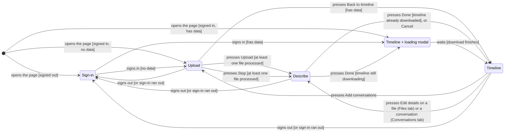

# Screen flow: sign-in, upload, conversation details, timeline

**Status:** proposed 2026-10-05, revised four times the same day with the user's answers; not approved. Open
questions are in §12.

**What this replaces.** Three items in the migration plan's list of work after the deployment
checks: [the load-screen rewrite (line 1442)](2026-09-09-rust-aws-backend-migration.md#L1442),
[the restore screen with a Stop button (line 1445)](2026-09-09-rust-aws-backend-migration.md#L1445),
and [the leftover "Picked up where you left off" notice (line 1451)](2026-09-09-rust-aws-backend-migration.md#L1451).
In the new flow, restoring happens behind a modal that blocks the page, so nothing can be started
during a restore; the notice is removed. The three items are marked as replaced in the migration
plan (the user's decision, Q12).

**Scope.** This plan builds the page flow and the storage it needs. Reading other assistants'
export formats, and guessing details from a file's contents, are later plans (§11).

## 1. Goal

The page today has two screens: a combined load-and-sign-in screen, and the timeline. The user
wants five pages, each with one job, and a defined path between them:

| Page | Shown when | What it holds |
|---|---|---|
| **Sign-in** | You are signed out | What the app does, and a Sign in button |
| **Upload** | Signed in with no data, or you asked to add conversations | A file chooser that takes several files, the scan checkbox, Upload, the progress bar, Stop |
| **Describe** (the user's "metadata screen") | Your files just finished processing, or you chose a file from the Timeline's Files tab | For each file: who took part, what kind of conversation, the transcription service, and each conversation's date and time |
| **Timeline** | Signed in with data | Today's tabs (Calendar, Conversations, Review & flags, Analytics), a new **Files** tab, and an "Add conversations" button |
| **Loading modal** | Over the Timeline, while your data downloads | "Loading your timeline", the download's progress bar; closes by itself when done |

A **modal** here means a box drawn in front of the page that blocks clicks on everything behind
it until it closes.

**Metadata** here means the details about a conversation that aren't in its messages: who took
part, how it was held, how it was transcribed, when it happened, and which file it came from.

"Add conversations" adds to what you have; it never replaces it. That matches the server today:
I read in [export.rs:59-80](../../backend/timeline-api/src/routes/export.rs#L59-L80) that `GET
/export` combines every upload you have made, and in
[processing.rs:255-275](../../backend/timeline-api/src/processing.rs#L255-L275) that each upload's
conversations are written without deleting earlier ones. There is no way in this plan to remove
data; that stays with [the development-only delete checkbox plan](2026-10-02-dev-delete-before-load.md).

## 2. What happens today (measured 2026-10-05)

From a throwaway browser test run against the local backend and the tests' stand-in for Cognito
(Amazon's sign-in service), not committed:

- Restore runs once, when the page opens ([main.js:83-85](../../frontend/main.js#L83-L85)). Signed
  out, it does nothing; signing in goes away to Cognito and back, the page opens again, and the
  restore runs then. Throughout, the load screen stays usable in front of the download.
- **Back to the page's first entry does nothing visible.** The first entry has no `#tab` in its
  address, and [router.js:15](../../frontend/ui/router.js#L15) ignores an empty one, so the page
  stays on whatever tab you were on.
- **Leaving the app and coming Forward, or Back across the sign-in, reopens the page and downloads
  your whole export again.**
- Not observed: what real Cognito's own login page does when Back lands on it after sign-in, and
  whether a real Chrome shows a cached copy of the page instead of reopening it (the test browser
  reopened it every time).

## 3. The state machine

A **state machine** here means: the page is always on exactly one of five pages, and only the
arcs below move it to another. Each arc is labelled with what the user does, and in brackets the
condition that picks between arcs.



The same arcs as a table, which is also the list the unit tests check (§10):

| From | User action [condition] | To |
|---|---|---|
| (page opened) | [signed out] | Sign-in |
| (page opened) | [signed in, no data] | Upload |
| (page opened) | [signed in, has data] | Timeline + loading modal |
| Sign-in | signs in [no data] | Upload |
| Sign-in | signs in [has data] | Timeline + loading modal |
| Upload | presses Upload [every file finished, at least one processed] | Describe, for the processed files |
| Upload | presses Stop [at least one file processed] | Describe, for the processed files |
| Upload | presses Back to timeline [has data] | Timeline |
| Describe | presses Done [still downloading] | Timeline + loading modal |
| Describe | presses Done [already downloaded] | Timeline |
| Describe | presses Cancel (leaves without saving) | Timeline |
| Timeline + loading modal | waits [download finishes] | Timeline |
| Timeline | presses Add conversations | Upload |
| Timeline | presses Edit details on a file in the Files tab | Describe, for that file |
| Timeline | presses Edit details on the open conversation in the Conversations tab | Describe, for that conversation |
| Upload, Describe, Timeline | signs out, or the sign-in runs out | Sign-in |

The next visit never opens on Describe. A file you uploaded and never described keeps its guessed
details (§7) until you change them from the Files tab or the Conversations tab.

Describe → Timeline returns to where you came from: the Calendar after an upload, the Files tab or
the open conversation otherwise.

Failures don't change the page; they show on the page you're on, with what you can do next:

| Page | Failure | Shown, and what you can do |
|---|---|---|
| Sign-in | Deployment settings unreadable, or Cognito refuses the sign-in | The error; Sign in again |
| (page opened) | Server unreachable while checking for data | Sign-in page's error line; Try again |
| Upload | A file fails | A line for that file below the progress bar, with the reason; the other files carry on |
| Upload | Every file fails, or Stop before any file is processed | The failures below the bar; choose files and press Upload again |
| Describe | Some files in the batch failed or were stopped | A reminder at the top naming each one and why |
| Describe | Saving fails | The error; every answer kept; press Done again |
| Timeline + loading modal | Download or server error | The error in the modal; Try again, or Sign out (→ Sign-in) |

Notes:

1. **Signing in leaves the page.** Cognito's sign-in sends you to Cognito's site and back, and
   the return is a fresh page load, so the two "signs in" arcs are really "opens the page" arcs
   on the return. Local development's typed name doesn't leave the page.
2. **"Has data" is asked with `GET /conversations`**, an existing route
   ([app.rs:23](../../backend/timeline-api/src/app.rs#L23)) that lists your conversations'
   summaries without reading the files. Today the page asks for the whole export to find out
   ([load-flow.js:92-96](../../frontend/ui/load-flow.js#L92-L96)). While the answer is awaited,
   the page shows a "Checking…" line; it is not one of the five pages.
3. **Timeline + loading modal** is the Timeline with the modal in front. The tabs are drawn empty
   behind it and filled in when the download finishes.
4. **Describe → Timeline usually skips the modal.** After an upload, the download starts as soon
   as the files are done (and the scan, if ticked, has run), in the background while you look over
   the details. Coming from the Files or Conversations tab, the timeline is already loaded. Saving
   details doesn't change messages, so it needs no new download; the page re-reads the metadata
   (§8c) and redraws, since an edited start or end time can move a conversation that has no
   message times (§7f).
5. **The sign-in running out.** Cognito's sign-in lasts an hour
   ([cognito-login.js:10-12](../../frontend/infra/cognito-login.js#L10-L12)). Any request that
   fails with "sign in first" moves to Sign-in with the message "Your sign-in ran out; sign in
   again." The quiet renewal in [the migration plan's stale sign-in item (line 1462)](2026-09-09-rust-aws-backend-migration.md#L1462)
   stays a separate piece of work. Details typed but not saved are lost in that case (C6).

The machine itself is a plain function with no page access, `nextPage(page, event)` in a new
[frontend/core/screen-flow.js](../../frontend/core/screen-flow.js), so every row of the first table
is checked by a unit test (§10). A separate module shows whichever page it names.

## 4. Addresses and the Back button

Each page gets an address, so a reload reopens the right place and Back behaves predictably:

| Page | Address | Added to history? |
|---|---|---|
| Sign-in | `#signin` | replaces the current entry |
| Upload | `#upload` | **new entry** when reached from Timeline's "Add conversations"; otherwise replaces |
| Describe | `#describe` after an upload; `#describe/file/<id>` from the Files tab; `#describe/conversation/<id>` from the Conversations tab | **new entry**, always, so Back has a page entry to land on and can be undone (below) |
| Timeline | today's `#calendar`, `#conversations/3` and so on, plus `#files` | replaces on arrival; tab clicks add entries as today |
| Timeline + loading modal | the Timeline's address | the modal adds nothing |

Consequences:

- **The first Timeline entry gets `#calendar` written in on arrival** (replacing, not adding), so
  Back to it shows the Calendar instead of doing nothing (§2's first finding).
- **Back from Upload, reached through "Add conversations", returns to the Timeline**, as long as
  nothing is being sent.
- **Back while files are sending, or on Describe, is refused** (Q8): the page puts the page's
  address back and shows "Your files are still being sent; press Stop to stop" or "Press Done to
  save, or Cancel to leave without saving". **How far this can go:** a page can't stop the
  browser's Back; it can only notice the address changed and step forward again. That works while
  the entry Back lands on is one of the page's own, which is why Describe always adds an entry. If
  Back would leave the app altogether (possible only while sending, when Upload was the first page
  of the visit), the page can at most ask the browser to show its own "Leave site?" question, and
  browsers show that only after the user has clicked on the page.
- **The address can't skip the checks.** Opening `…#upload` while signed out shows Sign-in;
  opening `…#describe` with no batch in progress shows the Timeline; `…#describe/file/<id>` or
  `…#describe/conversation/<id>` for something that isn't yours shows the Timeline. The address says where you'd like to be; the state
  machine decides where you are.
- **Back across a Cognito sign-in still reopens the page.** A page can't remove history entries
  made before it. The sign-in library can open Cognito by replacing the current entry instead of
  adding one (`oidc-client-ts`'s `redirectMethod: "replace"` option, which I read in its
  documentation and have not tried), which takes the signed-out page out of history. Whether real
  Cognito's login form then adds an entry of its own is unknown until tried against the deployed
  site (C4).

## 5. The Sign-in page

- A heading and a short explanation of what the app does. The user accepted this wording for now
  (Q1):

  > **A record of your conversations with AI.** Upload the conversation exports from your AI
  > assistant, say who was talking and how, and see your conversations laid out by day: when you
  > talked, for how long, and the moments that went badly. You can mark messages that were
  > critical, angry or shouted, and download your files back with your marks in them. Your files
  > are stored in your account so you can come back to them.

  The current header claims "nothing is uploaded anywhere" ([timeline.html:705](../../timeline.html#L705)),
  which has been untrue since the backend was added; it goes.
- Deployed: the Sign in button. Local development: the dev name field and a Continue button, in
  the same place.
- A sign-in that fails (unreadable deployment settings, refused code) shows its error here, as
  [login-panel.js](../../frontend/ui/login-panel.js) does today.
- "Signed in as …" and Sign out move to a small header line on Upload, Describe and Timeline.

## 6. The Upload page

- The file chooser accepts several files (`<input type="file" multiple>`). Chosen files are listed
  with their sizes, each with a Remove button, so a wrong pick doesn't mean starting over.
- The scan checkbox stays, with its text as today.
- Upload button directly under the file list (the item at [line 1442](2026-09-09-rust-aws-backend-migration.md#L1442)
  complained that the button sat far from the chooser).
- **Sending several files:** each file gets its own `POST /uploads`, its own `PUT`, and its own
  wait for processing, all at the same time. One combined bar measures bytes sent across all
  files, with the time remaining (Q4: one combined bar). Below the bar, a line appears for each file that fails, with
  its reason; the other files carry on.
- **Stop** is shown for as long as anything is sending or processing. Pressing it:
  - cancels every file still sending (the browser's request is aborted) and stops waiting for files
    still processing;
  - moves to Describe for the files already processed, with the stopped files named in the
    reminder at the top; or stays on Upload if none was processed.
  - **What Stop can't undo:** a file whose bytes reached the server is processed there whether or
    not the page waits (on AWS, the file landing in storage starts processing by itself). It then
    appears in the Files tab with guessed details. The stopped-file reminder says so. Stop never deletes anything (Q14).
- After the last file finishes: if the scan box is ticked, the scan runs once over all your
  conversations (it already covers every conversation you have, not only new ones —
  [detect.rs:80](../../backend/timeline-api/src/routes/detect.rs#L80); C5); then the export
  download starts in the background and the page moves to Describe.
- "Back to timeline" appears only when you already have data and nothing is sending.

**Reused, not rewritten:** `putWithProgress`, `downloadSignedExport`
([api-client.js](../../frontend/infra/api-client.js)), `waitForProcessing`
([upload-wait.js](../../frontend/core/upload-wait.js)), the progress-bar functions and
`makeRateEstimator` ([status-indicators.js](../../frontend/ui/widgets/status-indicators.js)),
`applyExportText` and `runDetectionPass` ([load-flow.js](../../frontend/ui/load-flow.js)). Changes:
the combined bar feeds the rate estimator the sum across files (the same function, given different
numbers); `putWithProgress` and `waitForProcessing` each gain a way to be cancelled, for Stop.

## 7. The metadata, and the Describe page

### 7a. Metadata lives on each conversation

Each conversation carries its own metadata, and can be edited on its own (from the Conversations
tab) or together with the rest of its file (from the Files tab, or right after an upload).

| Field | Values | Set by |
|---|---|---|
| **Source file** | the original file name, and the date and time it was uploaded: the first file the conversation appeared in (§8b) | the upload; never edited |
| **Participants** | a list of: Human (with a name, typed freely), Claude, ChatGPT, Gemini, Other AI (with a name). More than two allowed. | guessed at upload; edited per file or per conversation |
| **Kind of conversation** | **Typed**; **Virtual voice** — held in an online meeting room such as Zoom or Meet, each person recorded by the microphone on their own computer; **Live voice** — held in a shared physical space, recorded by a single microphone or written down by a person rather than a machine | guessed at upload; edited per file or per conversation |
| **Transcription** | only for the two voice kinds; one of the list in §7c | guessed at upload; edited per file or per conversation |
| **Start and end** | when the conversation started and ended, shown in your browser's time zone, stored with their offset from UTC | guessed at upload; edited per conversation only |
| **Guessed or confirmed** | kept separately for the details (participants, kind, transcription) and for the start and end, so a later upload can tell whether it may update a guess (§8b) | set when you save |

The kind of conversation tells a reader the circumstances, and so which errors to expect in the
text: crosstalk and a missing speaker in live voice, per-person audio but meeting-software
transcription errors in virtual voice.

### 7b. The guess made at upload

Every new conversation gets metadata as soon as its file is processed, so nothing is left without
details if you leave Describe without changing anything. In this plan the "guess" is fixed
defaults, made in one function so that the later guessing plan replaces only that function:

- **Participants:** one Human named with your sign-in (your email when deployed, your dev login
  name locally), and Claude. The server reads only Claude's export format today
  ([format.rs:1-3](../../backend/timeline-core/src/format.rs#L1-L3)), and every file used so far
  has one human and one assistant.
- **Kind:** Typed. **Transcription:** none (Typed has none).
- **Start and end:** the times of the conversation's earliest and latest messages. Every message in
  a Claude file has its own time (`created_at`, which
  [model.rs:163](../../backend/timeline-core/src/model.rs#L163) requires). A conversation with no
  messages gets neither.
- **Guessed or confirmed:** guessed, for both.

### 7c. Transcription services

Suggested list, from my general knowledge, not checked against each vendor's current documentation:

| Choice | Notes |
|---|---|
| Zoom | Meeting software with its own transcripts |
| Google Meet | ditto |
| Microsoft Teams | ditto |
| Webex | ditto |
| Skype | Microsoft retired it in 2025; kept for older recordings |
| Otter.ai | A separate transcriber that joins meetings or transcribes recordings |
| Fireflies.ai | ditto |
| Rev | Machine transcription, or paid human transcribers |
| Whisper | OpenAI's speech-to-text model, used inside many apps |
| A phone's built-in recorder | e.g. Google's Recorder app, Apple's Voice Memos transcripts |
| A person | Written down by hand, the usual case for live voice |
| Don't know | |
| Other | typed freely |

Whether the meeting providers share speech engines is unknown to me and not looked up; if it
matters for expected errors, the guessing plan can record the engine separately from the service.

### 7d. The page

Describe opens on one of three subjects:

| Opened from | Subject | Shows |
|---|---|---|
| Upload, after files finish | the batch's processed files | one section per file, or one for all (below) |
| Files tab, Edit details | one file | that file's section |
| Conversations tab, Edit details | one conversation | that conversation's details, start and end |

- **A file's section** is headed by file name, upload time, and counts: conversations first seen
  in this file, and conversations already present from an earlier file (with how many of those
  gained new messages; §8b). It holds participant rows (add, remove, choose kind, type a name), the
  kind of conversation as three choices with the explanations from §7a, and the transcription list,
  shown only for the voice kinds. Start and end are not edited here: they differ by conversation,
  and the file's section lists its conversations only by name and time range, each with a link to
  edit it on its own; the list starts collapsed, since one file can hold hundreds (C14). If any of
  the file's conversations has times on some messages but not others, the heading warns: "N
  conversations have times on only some messages; they are placed by their start and end" (Q19).
- **Several files after an upload** start as one form, headed "These N files", with a checkbox
  **"Describe each file separately"**; ticking it splits the form into one per file, each starting
  from the answers already given; unticking it asks before throwing away the differences. With one
  file, there is no checkbox. At the top, the reminder of files that failed or were stopped (§6).
- **When a file's conversations don't agree** (some were edited one by one), a field shows
  "Varies — leave as is" until you change it. Saving a file changes only the fields you changed,
  so editing the kind of a whole file doesn't undo someone's per-conversation participant edits.
- **A conversation's page** has the same three fields plus start and end. Its heading names the
  file it came from.
- **Done** saves (§8c) and goes back to where you came from (§3). The guesses already pass the
  rules, so Done is never blocked until you change something into a rule-breaking answer (an empty
  participant list, a voice kind with no transcription choice, a Human or Other AI with no name, an
  end before the start, a start without an end or the reverse); the field is marked and Done waits.
  A failed save keeps every answer on screen and shows the error.
- **Cancel** leaves without saving and goes back to where you came from (the Calendar after an
  upload, where the guesses stay as they are). Shown in every mode.

### 7e. Where editing starts on the Timeline

- **A new Files tab** lists every uploaded file, newest first: file name, upload date and time,
  number of conversations, kind of conversation and participants (or "varies"), and "guessed" or
  "confirmed". Each row has **Edit details**, opening Describe for that file.
- **The Conversations tab** gains, above the open conversation's transcript, a line with its kind,
  participants, start and end, and its own **Edit details** button, opening Describe for that
  conversation.

### 7f. Where a conversation sits on the timeline

- **Messages with times** place the conversation, as today: sessions are built from message times
  in [blocks.js](../../frontend/core/blocks.js).
- **A conversation whose messages have no times** is drawn as one session from its start to its
  end, and moves when you edit them. With no start and end either, it is listed in the
  Conversations tab but not drawn on the Calendar, and its line there says "No date — edit details
  to place it".
- **Some messages with times and some without:** placed by its start and end, and the upload
  warns about it (§7d; the user, Q19, expects this to be rare).
- No file the server reads today has messages without times, so the second and third rules can
  only be shown by tests that hand the page such conversations directly (C15).

## 8. Server changes

### 8a. Types (Rust, in `timeline-core`)

Built so that metadata that breaks the rules can't be represented, rather than checked everywhere
it's read:

```rust
pub struct ConversationMetadata {
    pub source: SourceFile,                 // never changed after upload
    pub participants: Participants,         // a list that can't be empty
    pub medium: ConversationMedium,
    pub details_origin: MetadataOrigin,     // Guessed | Confirmed: participants, medium
    pub span: Option<ConversationSpan>,     // None: no messages and no times entered
    pub span_origin: MetadataOrigin,
}
pub struct ConversationSpan {               // built only when start <= end
    start: DateTime<FixedOffset>,
    end: DateTime<FixedOffset>,
}
pub struct SourceFile {
    pub upload_id: UploadId,
    pub file_name: FileName,
    pub uploaded_at: DateTime<Utc>,
}
pub enum Participant {
    Human { name: PersonName },
    Claude,
    ChatGpt,
    Gemini,
    OtherAi { name: AiName },
}
pub enum ConversationMedium {
    Typed,
    VirtualVoice { transcription: TranscriptionService },
    LiveVoice { transcription: TranscriptionService },
}
pub enum TranscriptionService {
    Zoom, GoogleMeet, MicrosoftTeams, Webex, Skype, OtterAi, Fireflies, Rev, Whisper,
    PhoneRecorder, Person, Unknown, Other(ServiceName),
}
```

`PersonName`, `AiName`, `ServiceName` and `FileName` are single-field wrappers around text, each
trimmed, stripped of control and invisible characters (zero-width, right-to-left override, NUL),
and limited to 200 characters when the request is read; an empty one is refused. These are
**newtypes** (a type that wraps one value so the compiler won't accept, say, a file name where a
person's name belongs). `ConversationSpan` can only be built through a constructor that refuses an
end before the start, and start and end come as a pair, so "a start without an end" can't be
stored.

"Typed has no transcription service" is enforced by the shape of `ConversationMedium`, not by a
check. Each named transcription service is kept, rather than folded into `Other`, because the
later guessing and error-analysis work treats them differently by name; if that turns out not to
be so, they fold into `Other` (the project's catchall rule).

The guess in §7b is one function, `guess_metadata(conversation, &UploadFacts) ->
ConversationMetadata`, in a new `timeline-core/src/conversation_metadata.rs` next to these types.

An edit is its own type, `MetadataEdit`, with every field optional: `None` means "leave as is".
That is what lets a file-wide save change only the fields you changed (§7d), and the same type
serves a single conversation. A file-wide edit can't carry a start and end; the route refuses one
that tries (§8c).

### 8b. Where they're kept

On the conversation's existing summary row: `ConversationSummary`
([conversations.rs:36-42](../../backend/timeline-core/src/ports/conversations.rs#L36-L42)) gains a
`metadata` field, so the in-memory and DynamoDB adapters of the existing
`ConversationSummaryStore` carry it. No new table, so no template change for storage.

The facts the guess needs but the file doesn't hold (the file's name, when it was uploaded, and
the name to give the human) are written by `POST /uploads` onto the per-upload row that
`UploadOutcomeStore` already keeps in the same table
([uploads.rs:8-12](../../backend/timeline-core/src/ports/uploads.rs#L8-L12)), through a new
`record_received` method, and read back by the processing step, which runs separately on AWS.

### 8b-2. Recognizing conversations you uploaded before

A later Claude export usually contains every earlier conversation again, often with new messages
added since. The user decided (2026-10-05) that such a conversation is recognized, not added a
second time, and any new messages in it are added.

**How it's recognized:** by the conversation's id (the `uuid` every conversation in a Claude file
carries, [model.rs:170](../../backend/timeline-core/src/model.rs#L170)). The stored time range and
message count live on the conversation's summary row, so recognizing a conversation and choosing
its new messages reads only the new file and that row, never an earlier file.

**Conversations without ids** (the user's rule, 2026-10-05, C16): an earlier conversation is
re-read only when (a) the new conversation has no id, (b) the stored one has no id either, and (c)
their time ranges overlap. Every other case is decided from ids and the stored rows. No format the
server reads today has conversations without ids (the parser requires `uuid`), so this rule is
built by the first plan that reads such a format, not here, where nothing could reach it.

**Which messages are new: by timeframe, not one by one** (the user, 2026-10-05, Q18). The stored
conversation has a time range: the times of its earliest and latest stored messages. From a later
file, only messages timed before that range or after it are added; everything inside it is taken
to be already present. Stored messages are never compared with the new file's messages. Untimed
messages in a later file are not added (they can't be placed against the range) and are counted in
the upload's warning (§7d).

**What happens today, from reading the code:** the summary row is overwritten by conversation id
([conversations.rs:20-24](../../backend/timeline-core/src/ports/conversations.rs#L20-L24)), and its
`upload_id` then points only at the newest file
([processing.rs:257-262](../../backend/timeline-api/src/processing.rs#L257-L262)). The export
rebuilds the conversation from that one file
([export.rs:71-80](../../backend/timeline-api/src/routes/export.rs#L71-L80)). So the conversation
isn't duplicated, but its messages are whatever the newest file holds: if you upload an older
export after a newer one, the newer messages disappear from your timeline. This plan fixes that.

**The change:**

- **The added messages are saved on their own at upload**, as one small stored object per
  conversation per later file (`additions/{user}/{conversation}/{upload}.json`), holding only the
  messages that file added. The summary row keeps the first file that held the conversation, its
  stored time range and message count, and the list of its additions. The single `upload_id` field
  is replaced by these.
- **The export rebuilds the conversation from the first file plus its addition objects**, in time
  order, so it never re-reads a later file in full (C16). The existing retried-message clean-up,
  `dedup_chat_messages` ([dedup.rs:28](../../backend/timeline-core/src/dedup.rs#L28)), runs over
  the joined list, since a retry can straddle two files; it's the same function the upload already
  runs on each file.
- **Metadata:** the conversation keeps its metadata and its source file (the first file it came
  in). If the new file brings messages earlier than its start or later than its end, and the start
  and end are still guessed, they widen to cover them; once you've confirmed them, they're left as
  you set them.
- Your reviews and flags are kept by message id already, so they carry over untouched.
- **Processing reports the timeframes:** for each file, how many conversations were new, how many
  were already present, and how many of those gained messages, with the earliest and latest new
  message time. Describe shows these counts in each file's heading (§7d). Processing also logs,
  per conversation, when the stored conversation ends up with fewer messages than the new file's
  copy of it (C18).

### 8c. Routes

| Route | Does |
|---|---|
| `POST /uploads` | Now takes `{ "file_name": …, "human_name": … }` and records them with the upload time (C3). |
| `GET /conversations` | Existing; each conversation now comes with its metadata. The page reads it with the export, for the Conversations tab, the Files tab and placement (§7f). |
| `GET /uploads` | Lists your files, built from the conversations' metadata (a conversation counts toward its source file): upload id, file name, upload time, counts from §8b-2, the file-level fields or "varies", guessed or confirmed. The Files tab and Describe read it. |
| `PUT /uploads/{upload_id}/metadata` | Applies one `MetadataEdit` to every conversation whose source is that file; only the fields given change; marks those fields confirmed. Refuses a file that isn't yours (404), an edit carrying a start and end (400), and one that breaks the rules (400, naming the field). |
| `PUT /conversations/{conversation_id}/metadata` | Applies one `MetadataEdit` to one conversation, start and end included. Refuses a conversation that isn't yours (404) and one that breaks the rules (400, naming the field). |

## 9. Page layout and modules

New modules under [frontend/](../../frontend/), one job each:

| Module | Job |
|---|---|
| `core/screen-flow.js` | The state machine (§3): the five pages, the events, `nextPage`. No page access. |
| `core/conversation-metadata.js` | Form answers ↔ the server's metadata JSON, and the rules in §7d, checked once when Done is pressed. No page access. |
| `core/upload-batch.js` | Several files' sends and waits at once: the combined progress, each file's outcome, Stop. No page access; given the send and wait functions. |
| `ui/screens/screen-host.js` | Shows the one page the state names, hides the rest, writes the address (§4), and handles hashchange for pages. Replaces the screen-switching now split between [main.js:31-43](../../frontend/main.js#L31-L43) and `applyExportText`. |
| `ui/screens/sign-in-screen.js` | §5. Takes over [login-panel.js](../../frontend/ui/login-panel.js). |
| `ui/screens/upload-screen.js` | §6. Takes the upload half of [load-flow.js](../../frontend/ui/load-flow.js). |
| `ui/screens/describe-screen.js` | §7d. |
| `ui/screens/loading-modal.js` | The modal, its bar and its error state. Takes the restore half of load-flow.js. |
| `ui/views/files.js` | The Files tab (§7e), next to the other tabs' views. |
| (changed) [core/blocks.js](../../frontend/core/blocks.js) | Places a conversation without message times by its start and end (§7f). |
| (changed) [ui/views/conversations.js](../../frontend/ui/views/conversations.js) | The details line and Edit details button (§7e). |
| `infra/metadata-client.js` | Calls to the routes in §8c, through the existing `apiFetch`. |

[load-flow.js](../../frontend/ui/load-flow.js) keeps only what both the upload and the modal share
(`applyExportText`, the scan pass). Removed: `tryRestoreSession`, the restored notice and its
dismiss button, "Load a different file". [timeline.html](../../timeline.html) gets one section per
page, the modal and the Files tab; their look follows the page's existing style (orange accents,
the current fonts).

**Activity log.** Records carry the shown tab, or '' when the tabs aren't shown
([activity-capture.js:24-26](../../frontend/ui/activity-capture.js#L24-L26)). With five pages,
'' no longer says where you were, so records gain a `screen` field (signIn, upload, describe,
timeline), set by screen-host through a `noteScreenShown` replacing `noteMainShown`
([activity-sink.js:51-53](../../frontend/core/activity-sink.js#L51-L53)), and the modal's
open/close, Stop, and every page change are recorded as events. Free text (names, file names) is
never recorded, only which fields changed, matching how sign-in emails are kept out today.

## 10. Tests

- **Unit, `screen-flow.js`:** every row of §3's arc table, plus every event a page must ignore
  (Upload pressed again while files are sending, for example).
- **Unit, `conversation-metadata.js`:** each rule in §7d, both ways; same-for-all copied to every
  file; separate answers kept apart; "varies" fields left out of a file-wide save; start and end
  round-trip with their offset.
- **Unit, `upload-batch.js`:** combined progress across files; one failure leaves the others
  running; Stop cancels sends and waits and reports which files were processed, failed or stopped.
- **Unit, `blocks.js`:** a conversation without message times becomes one session from its start
  to its end, and moves when they change; one without times or a start and end is not drawn; one
  with some timed and some untimed messages is placed by its start and end (§7f, C15).
- **Rust, through the public API:**
  - `guess_metadata` on the fixture: participants, Typed, earliest and latest message times;
    nothing for an empty conversation.
  - Processing writes metadata on every new conversation.
  - Re-uploading: the same file again adds nothing and writes no addition objects; a later file's
    added messages are saved as addition objects and the export reads those, not the later file; a later file with new messages in a known
    conversation adds them, keeps the metadata and source file, widens a guessed start and end and
    leaves a confirmed one alone; messages inside the stored range are not added, even if the new
    file's copy of them differs; an older file uploaded after a newer one adds nothing and loses no
    messages; untimed messages in a later file are not added and are counted for the warning; a
    retried message straddling two files is cleaned up; the counts in §8b-2 are right.
  - Each route in §8c, including each refusal and another user's file or conversation; a file-wide
    edit changes only the fields it carries.
  - Names over 200 characters, control characters and invisible characters handled as in §8a; an
    end before a start refused.
  - In-memory and DynamoDB adapters through the same port tests (DynamoDB against the real
    service, as [dynamo_conversations_table.rs](../../backend/timeline-storage/tests/dynamo_conversations_table.rs) does).
- **Browser (Playwright, against the local backend and Cognito stand-in):**
  - Signed out → Sign-in with the explanation; sign in with no data → Upload; sign in with data
    → Timeline behind the modal → modal closes.
  - Three files at once: one combined bar; all reach Describe as one form; "Describe each file
    separately" splits it; Done saves (read back through `GET /uploads`) and opens the Calendar.
  - One of two files rejected by the server: its line appears below the bar; the other reaches
    Describe with the reminder at the top.
  - Stop with one file processed and one still sending: Describe for the processed one, the other
    named as stopped.
  - Leaving Describe by reloading: the files are in the Files tab, marked guessed; the next visit
    opens the Timeline, not Describe.
  - Files tab → Edit details → change the kind to Virtual voice, choose Zoom → Done → the Files tab
    shows confirmed and the new values; Back from Describe instead leaves them unchanged.
  - Conversations tab → Edit details → change participants and the end time → Done → the open
    conversation shows them; the Files tab shows "varies" for that file's participants; a file-wide
    kind change afterwards leaves that conversation's participants as edited.
  - Uploading a second file that repeats a known conversation with extra messages: Describe's
    heading counts it as already present with new messages; the Conversations tab shows the
    conversation once, with the extra messages.
  - Add conversations from the Timeline → Upload; Back → Timeline; after adding, the Timeline holds
    the old and new conversations.
  - Back: the first Timeline entry shows the Calendar; Back on Describe after an upload is refused
    with the message.
  - A download failure in the modal shows the error; Try again succeeds.
  - Expired sign-in during the Timeline → Sign-in with the "ran out" message.
- **Not tested here:** real Cognito's own pages under Back (C4) — checked by hand on the deployed
  site, and recorded in an analysis. Placement of untimed conversations through the whole page
  (C15).

Existing browser tests that drive the old load screen
([views.spec.js](../../e2e/views.spec.js), [cognito-login.spec.js](../../e2e/cognito-login.spec.js),
[upload-flow.spec.js](../../e2e/upload-flow.spec.js), and others) will need their page-driving
steps changed to the new pages. Per the project rules, that's changing committed tests, so the
list of tests to change, with each change, comes to the user for approval before coding (C7).

## 11. Not in this plan

- **Guessing metadata from a file's contents.** A later plan replaces `guess_metadata` (§8a); the
  user approves or edits the guesses through the same Describe page. This plan's guesses are fixed
  defaults (§7b).
- **Reading other export formats** (ChatGPT, Gemini, voice transcripts, files naming several
  humans). Later plans; the participant kinds exist so that their metadata has somewhere to go.
- **Recognizing conversations that have no id** (the user's rule is recorded in §8b-2); built with
  the first format whose conversations lack ids.
- **Writing metadata into the downloaded file** (the user, 2026-10-05: not needed for now).
- **Deleting data, or files Stop couldn't recall** (the user, 2026-10-05: a separate delete
  feature, later).
- **Quiet renewal of an expired sign-in** (the migration plan's own item).

## 12. Questions for the user

Questions keep their numbers for the whole life of the plan, so they are labelled "Q" with the
number written out rather than as a numbered list (which Markdown renumbers on display).

**Answered on 2026-10-05**, and folded in above:

- **Q1** — the sign-in wording is fine for now (§5).
- **Q2** — a human's name is typed freely; the sign-in name fills in the one human (§7b).
- **Q5** — failures are noted below the bar; Stop at any time; Describe shows the rest with a
  reminder (§6).
- **Q6, Q13** — editing later from a Files tab on the Timeline, and per conversation from the
  Conversations tab (§7d, §7e).
- **Q7** — guesses are made at upload; the next visit doesn't return to Describe (§3).
- **Q9** — what the two voice kinds mean (§7a).
- **Q10** — the suggested list in §7c, for you to trim.
- **Q11** — page flow only; other formats later (§11).
- **Q14** — Stop doesn't delete anything; deleting is a later feature (§11).
- **Q15** — start and end per conversation; placed by message times when they exist, otherwise
  by start and end, which edits move (§7f).
- **Q16** — an earlier conversation is recognized, keeps its details, and gains new messages
  (§8b-2).
- **Q17** — no metadata in the downloaded file for now (§11).
- **Q3** — any non-empty participant list is fine (§7d).
- **Q4** — one combined bar (§6).
- **Q8** — Back is refused while sending and on Describe, as far as a page can (§4); Describe has
  a Cancel button to leave without saving (§7d).
- **Q18** — new messages are found by timeframe; existing messages are never compared (§8b-2).
- **Q19** — placed by start and end, with a warning at upload (§7d, §7f).
- **Q12** — yes: the three items it replaces in the migration plan
  ([lines 1442, 1445 and 1451](2026-09-09-rust-aws-backend-migration.md#L1442)) are marked as
  replaced by this plan (done 2026-10-05).

**Still open:** none.

**Formerly open, kept for the record:**

- **Q12 — The migration plan's list** (answered: yes). The migration plan's list of work after the deployment
  checks has three items this plan does instead. Once you approve this plan, should those three be
  marked "replaced by 2026-10-05-screen-flow.md"? The three, in that plan's words, shortened:
  - [Line 1442](2026-09-09-rust-aws-backend-migration.md#L1442), **"Rewrite the load screen."**
    The Load button sits far from the file chooser, separated by the sign-in area and a long
    paragraph about scanning; you found the page confusing. Replaced by §5 and §6 here.
  - [Line 1445](2026-09-09-rust-aws-backend-migration.md#L1445), **"A restore screen with a Stop
    button."** While your last session is restored, show a screen with who is signed in and the
    download's progress, and a Stop button that returns to the load screen; asked for because on
    2026-10-02 a new load was started during a restore and the old data briefly appeared as the
    new file. Replaced by the loading modal (§3): it blocks the page, so nothing can be started
    during a restore. There is no Stop on the modal; Sign out is offered if the download fails.
  - [Line 1451](2026-09-09-rust-aws-backend-migration.md#L1451), **"A leftover 'Picked up where
    you left off' notice."** The notice stays up after "Load a different file" and a fresh load.
    Replaced: both the notice and "Load a different file" are removed (§9).

## Self-critique log

### C1 [RESOLVED]: First draft fetched the full export to decide which page to show
Asking `GET /export` (as restore does today) makes the server rebuild and store a full export just
to learn "is there any data?", and then the page downloads it again for the Timeline.
**Resolution:** opening the page asks `GET /conversations` instead; see [§3, note 2 (line 143)](2026-10-05-screen-flow.md#L143).

### C2 [RESOLVED]: First draft made Describe wait for the download
Moving to the Timeline only after Done, then starting the download, puts the whole download wait
after the user has finished typing.
**Resolution:** the download starts in the background when processing ends; see [§3, note 4 (line 150)](2026-10-05-screen-flow.md#L150).

### C3 [RESOLVED]: File names would be lost on a reload
The server never learns a file's name today; only the browser knows it. With the user's decision
that the original file name is part of each conversation's metadata, the server must know it
before processing.
**Resolution:** `POST /uploads` takes the file name and the human's name, recorded on the upload's
row and read by processing; see [§8b (line 437)](2026-10-05-screen-flow.md#L437) and [§8c (line 510)](2026-10-05-screen-flow.md#L510).

### C4 [OPEN]: Back across real Cognito's pages is unmeasured
The stand-in Cognito skips the login form, so the browser tests can't show what Back does on
Cognito's own page after sign-in, or whether `redirectMethod: "replace"` helps.
**Mitigation in plan:** [§4 (line 196)](2026-10-05-screen-flow.md#L196) proposes the option and
marks it untried. **Open:** checked by hand on the deployed site after the first deployment of this
work, and written up in an analysis.

### C5 [OPEN]: The scan re-reads every conversation each time files are added
`POST /detect` pages through all your conversations
([detect.rs:80](../../backend/timeline-api/src/routes/detect.rs#L80)), so adding a small file to a
large account re-scans everything.
**Mitigation in plan:** none; the scan is still opt-in. **Open:** revisit if a scan after adding
files takes over a minute in the activity records, or the user reports it as slow.

### C6 [OPEN]: An expired sign-in on Describe loses typed answers
Moving to Sign-in means leaving for Cognito, and unsaved answers go with the page. Since the
user's revision, nothing is lost beyond the edits: the guesses are already stored.
**Mitigation in plan:** the "ran out" message ([§3, note 5 (line 156)](2026-10-05-screen-flow.md#L156)).
**Open:** solved by the migration plan's quiet-renewal item; if that slips, keep the answers in
sessionStorage. Trigger: the user reports losing answers, or the renewal item is deferred.

### C7 [OPEN]: Existing browser tests drive the old load screen
Their page-driving steps (pick a file, press Load, wait for `#mainContent`) won't match the new
pages.
**Mitigation in plan:** [§10 (line 607)](2026-10-05-screen-flow.md#L607) commits to bringing the
list of changes to the user before coding. **Open:** the list is written when the plan is approved.

### C8 [RESOLVED]: A conversation in two files
A later Claude export usually contains every earlier conversation too. In the first draft, metadata
belonged to the upload, so each conversation silently took the last file's description; in the
second, a re-upload would have replaced confirmed details with fresh guesses. Reading the code for
this showed a third problem, present today: the export rebuilds a conversation only from the newest
file that held it, so an older file uploaded after a newer one hides the newer messages.
**Resolution:** the user decided (2026-10-05) that an earlier conversation is recognized and keeps
its details, and new messages in it are added, judged by timeframe: only messages outside the
stored time range are added, and stored messages are never compared one by one (Q18); see [§8b-2 (line 450)](2026-10-05-screen-flow.md#L450).

### C9 [RESOLVED]: Free text from the form reaches the page, the server's storage and logs
Names and file names come from the user and are shown back on the page.
**Resolution:** trimmed, cleaned of control and invisible characters and limited in length when the
request is read ([§8a (line 375)](2026-10-05-screen-flow.md#L375)); shown on the page only as text,
never as markup; kept out of the activity log ([§9 (line 547)](2026-10-05-screen-flow.md#L547)).

### C10 [RESOLVED]: The first diagram was not a diagram of pages
The first draft's diagram mixed the five pages with brief checks, sending, and every failure as
states of their own (sixteen boxes); the user found it unreadable and asked for five pages with arcs
showing how a user moves between them.
**Resolution:** §3 now draws only the five pages, each arc labelled with the user's action and its
condition; failures are a separate table of what each page shows, not states. See [§3 (line 60)](2026-10-05-screen-flow.md#L60).

### C11 [RESOLVED]: Metadata belonged to the upload, not the conversation
The first draft stored one description per upload. The user wants metadata on each conversation,
carrying its original file name and upload date so a whole file can still be edited at once, and
(2026-10-05, Q13) editable one conversation at a time from the Conversations tab.
**Resolution:** metadata is a field of each conversation's summary row, with a `SourceFile` part;
file-level edits change only the fields you changed, on every conversation from that file, and a
conversation can be edited alone (`MetadataEdit`, [§8a (line 375)](2026-10-05-screen-flow.md#L375)); see [§7a (line 257)](2026-10-05-screen-flow.md#L257)
and [§8b (line 437)](2026-10-05-screen-flow.md#L437).

### C12 [RESOLVED]: An unfinished Describe left files without details
The first draft sent the next visit back to Describe for undescribed files. The user decided
instead that guesses are made at upload and the next visit opens the Timeline.
**Resolution:** the guess is written during processing ([§7b (line 275)](2026-10-05-screen-flow.md#L275));
the "opens the page → Describe" arc is gone ([§3 (line 60)](2026-10-05-screen-flow.md#L60)); Describe
is reached later from the Files tab ([§7e (line 351)](2026-10-05-screen-flow.md#L351)).

### C13 [OPEN]: Where the human's default name comes from
The server knows you by Cognito's user id, and I have not checked whether the access token the
page sends carries your email. So the page sends the name with `POST /uploads` (§8c) — which means
the server takes the default name on the page's word. It is only a default you can edit, so
nothing is trusted on it.
**Mitigation in plan:** the name passes the same cleaning as every other free text (§8a). **Open:**
if the token turns out to carry the email, the server takes it from there instead. Trigger: the
first deployment of this work (look at a decoded access token).

### C14 [RESOLVED]: A file of hundreds of conversations makes a long Describe page
Each section lists its file's conversations with their dates and times; one file can hold hundreds.
**Resolution:** the list starts collapsed; see [§7d (line 315)](2026-10-05-screen-flow.md#L315).

### C15 [OPEN]: Placing untimed conversations can't be shown end to end yet
The user wants a conversation whose messages have no times placed by its start and end. No file
the server reads today has untimed messages: the parser requires a time on every message
([model.rs:163](../../backend/timeline-core/src/model.rs#L163)). So the rule can be proven only by
unit tests that hand [blocks.js](../../frontend/core/blocks.js) such conversations directly, not by
a browser test through an upload.
The same holds for the upload's warning about conversations with times on only some messages
(Q19): processing can't meet one today, so it is tested by handing processing's counting function a
conversation directly.
**Mitigation in plan:** the rule lives in blocks.js and is unit-tested there ([§7f (line 360)](2026-10-05-screen-flow.md#L360)).
**Open:** the first plan that reads a format without message times adds the browser test. Trigger:
that plan.

### C16 [RESOLVED]: The export would re-read every file that held each conversation
The previous draft rebuilt each conversation at export time from every file that ever held it, so
repeated full exports of one account (the project's own was 64.7 MB) multiplied the reading.
**Resolution:** the user ruled (2026-10-05) that earlier conversations are re-read only when
neither side has an id and their time ranges overlap. With ids, recognition uses only the stored
summary row, and the messages a later file adds are saved on their own at upload, so the export
reads the first file plus small addition objects; see [§8b-2 (line 450)](2026-10-05-screen-flow.md#L450).
The id-less case is built with the first format that has one.

### C17 [RESOLVED]: Question numbers didn't match what the reader saw
§12 wrote open questions as a Markdown numbered list starting at 1, 3, 4, 8…; Markdown renumbers
such lists on display, so the user saw 1–5 and couldn't find Q3, Q4, Q8 or Q12.
**Resolution:** every question is labelled "Q" with its number as text; see [§12 (line 627)](2026-10-05-screen-flow.md#L627).

### C18 [OPEN]: Judging new messages by timeframe misses messages inside the range
With the user's rule (Q18), a message timed inside the stored range is assumed present. A message
an earlier export left out, or one whose time ties the range's first or last message exactly, is
never added.
**Mitigation in plan:** none; the user chose this rule. **Open:** revisit if a conversation's
message count after re-uploading is lower than the same conversation's count in the newest file
alone. Processing can count that at no extra cost and log it; this plan adds that log line
(§8b-2's report). Trigger: the log line firing.

