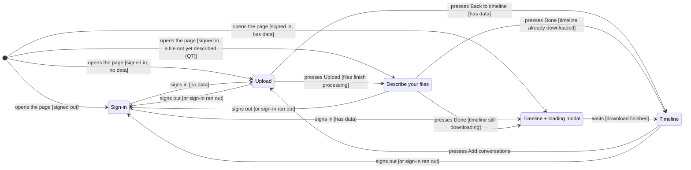

# Screen flow: sign-in, upload, file descriptions, timeline

**Status:** proposed 2026-10-05, not approved. Questions for the user are in §12.

**What this replaces.** Three items in the migration plan's list of work after the deployment
checks: [the load-screen rewrite (line 1442)](2026-09-09-rust-aws-backend-migration.md#L1442),
[the restore screen with a Stop button (line 1445)](2026-09-09-rust-aws-backend-migration.md#L1445),
and [the leftover "Picked up where you left off" notice (line 1451)](2026-09-09-rust-aws-backend-migration.md#L1451).
In the new flow, restoring happens behind a modal that blocks the page, so nothing can be started
during a restore; the notice is removed. The migration plan is not edited until the user agrees
(§12, Q12).

## 1. Goal

The page today has two screens: a combined load-and-sign-in screen, and the timeline. The user
wants five, each with one job, and a defined path between them:

| Screen | Shown when | What it holds |
|---|---|---|
| **Sign-in** | You are signed out | What the app does, and a Sign in button |
| **Upload** | Signed in with no data, or you asked to add conversations | A file chooser that takes several files, the scan checkbox, Upload, the progress bar |
| **Describe your files** (the user's "metadata screen") | Your files just finished processing | For each file (or all files at once): who took part, what kind of conversation, the transcription service |
| **Timeline** | Signed in with data | Today's tabs (Calendar, Conversations, Review & flags, Analytics), plus an "Add conversations" button |
| **Loading modal** | Over the Timeline, while your data downloads | "Loading your timeline", the download's progress bar; closes by itself when done |

A **modal** here means a box drawn in front of the page that blocks clicks on everything behind
it until it closes.

"Add conversations" adds to what you have; it never replaces it. That matches the server today:
I read in [export.rs:59-80](../../backend/timeline-api/src/routes/export.rs#L59-L80) that `GET
/export` combines every upload you have made, and in
[processing.rs:255-275](../../backend/timeline-api/src/processing.rs#L255-L275) that each upload's
conversations are written without deleting earlier ones. There is no way in this plan to remove
data; that stays with [the development-only delete checkbox plan](2026-10-02-dev-delete-before-load.md).

## 2. What happens today (measured 2026-10-05)

From a throwaway browser test run against the local backend and the tests' stand-in for Cognito
(Amazon's sign-in service), not committed:

- Restore runs once, when the page opens ([main.js:83-85](../../frontend/main.js#L83-L85)). Signed
  out, it does nothing; signing in goes away to Cognito and back, the page opens again, and the
  restore runs then. Throughout, the load screen stays usable in front of the download.
- **Back to the page's first entry does nothing visible.** The first entry has no `#tab` in its
  address, and [router.js:15](../../frontend/ui/router.js#L15) ignores an empty one, so the page
  stays on whatever tab you were on.
- **Leaving the app and coming Forward, or Back across the sign-in, reopens the page and downloads
  your whole export again.**
- Not observed: what real Cognito's own login page does when Back lands on it after sign-in, and
  whether a real Chrome shows a cached copy of the page instead of reopening it (the test browser
  reopened it every time).

## 3. The state machine

A **state machine** here means: the page is always on exactly one of five pages, and only the
arcs below move it to another. Each arc is labelled with what the user does, and in brackets the
condition that picks between arcs.



The same arcs as a table, which is also the list the unit tests check (§10):

| From | User action [condition] | To |
|---|---|---|
| (page opened) | [signed out] | Sign-in |
| (page opened) | [signed in, no data] | Upload |
| (page opened) | [signed in, has data] | Timeline + loading modal |
| (page opened) | [signed in, a file not yet described] (Q7) | Describe |
| Sign-in | signs in [no data] | Upload |
| Sign-in | signs in [has data] | Timeline + loading modal |
| Upload | presses Upload [files finish processing] | Describe |
| Upload | presses Back to timeline [has data] | Timeline |
| Describe | presses Done [still downloading] | Timeline + loading modal |
| Describe | presses Done [already downloaded] | Timeline |
| Timeline + loading modal | waits [download finishes] | Timeline |
| Timeline | presses Add conversations | Upload |
| Upload, Describe, Timeline | signs out, or the sign-in runs out | Sign-in |

Failures don't change the page; they show on the page you're on, with what you can do next:

| Page | Failure | Shown, and what you can do |
|---|---|---|
| Sign-in | Deployment settings unreadable, or Cognito refuses the sign-in | The error; Sign in again |
| (page opened) | Server unreachable while checking for data | Sign-in page's error line; Try again |
| Upload | Every file fails | Each file's reason; change files and press Upload again |
| Upload | Some files fail (Q5) | Each file's reason; Continue with the ones that worked (→ Describe), or Try the failed ones again |
| Describe | Saving fails | The error; every answer kept; press Done again |
| Timeline + loading modal | Download or server error | The error in the modal; Try again, or Sign out (→ Sign-in) |

Notes:

1. **Signing in leaves the page.** Cognito's sign-in sends you to Cognito's site and back, and
   the return is a fresh page load, so the two "signs in" arcs are really "opens the page" arcs
   on the return. Local development's typed name doesn't leave the page.
2. **"Has data" is asked with `GET /conversations`**, an existing route
   ([app.rs:23](../../backend/timeline-api/src/app.rs#L23)) that lists your conversations'
   summaries without reading the files. Today the page asks for the whole export to find out
   ([load-flow.js:92-96](../../frontend/ui/load-flow.js#L92-L96)). While the answer is awaited,
   the page shows a "Checking…" line; it is not one of the five pages.
3. **Timeline + loading modal** is the Timeline with the modal in front. The tabs are drawn empty
   behind it and filled in when the download finishes.
4. **Describe → Timeline usually skips the modal.** The download starts as soon as every file is
   processed (and the scan, if ticked, has run), in the background while you fill in the
   descriptions.
5. **The sign-in running out.** Cognito's sign-in lasts an hour
   ([cognito-login.js:10-12](../../frontend/infra/cognito-login.js#L10-L12)). Any request that
   fails with "sign in first" moves to Sign-in with the message "Your sign-in ran out; sign in
   again." The quiet renewal in [the migration plan's stale sign-in item (line 1462)](2026-09-09-rust-aws-backend-migration.md#L1462)
   stays a separate piece of work. Descriptions typed but not saved are lost in that case (C6).

The machine itself is a plain function with no page access, `nextPage(page, event)` in a new
[frontend/core/screen-flow.js](../../frontend/core/screen-flow.js), so every row of the first table
is checked by a unit test (§10). A separate module shows whichever page it names.

## 4. Addresses and the Back button

Each screen gets an address, so a reload reopens the right place and Back behaves predictably:

| Page | Address | Added to history? |
|---|---|---|
| Sign-in | `#signin` | replaces the current entry |
| Upload | `#upload` | **new entry** when reached from Timeline's "Add conversations"; otherwise replaces |
| Describe | `#describe` | replaces |
| Timeline | today's `#calendar`, `#conversations/3` and so on | replaces on arrival; tab clicks add entries as today |
| Timeline + loading modal | the Timeline's address | the modal adds nothing |

Consequences:

- **The first Timeline entry gets `#calendar` written in on arrival** (replacing, not adding), so
  Back to it shows the Calendar instead of doing nothing (§2's first finding).
- **Back from Upload, reached through "Add conversations", returns to the Timeline**, as long as
  nothing is being sent.
- **Back while files are sending, or on Describe, is refused** (Q8): the page puts the screen's
  address back and shows "Finish describing your files first" or "Your files are still being
  sent". A page can't stop the browser's Back; it can only undo it after the fact, so this is the
  nearest equivalent.
- **The address can't skip the checks.** Opening `…#upload` while signed out shows SignIn; opening
  `…#describe` with nothing left to describe shows the Timeline. The address says where you'd
  like to be; the state machine decides where you are.
- **Back across a Cognito sign-in still reopens the page.** A page can't remove history entries
  made before it. The sign-in library can open Cognito by replacing the current entry instead of
  adding one (`oidc-client-ts`'s `redirectMethod: "replace"` option, which I read in its
  documentation and have not tried), which takes the signed-out page out of history. Whether real
  Cognito's login form then adds an entry of its own is unknown until tried against the deployed
  site (C4).

## 5. The Sign-in screen

- A heading and a short explanation of what the app does. Draft wording, for the user to change
  (Q1):

  > **A record of your conversations with AI.** Upload the conversation exports from your AI
  > assistant, say who was talking and how, and see your conversations laid out by day: when you
  > talked, for how long, and the moments that went badly. You can mark messages that were
  > critical, angry or shouted, and download your files back with your marks in them. Your files
  > are stored in your account so you can come back to them.

  The current header claims "nothing is uploaded anywhere" ([timeline.html:705](../../timeline.html#L705)),
  which has been untrue since the backend was added; it goes.
- Deployed: the Sign in button. Local development: the dev name field and a Continue button, in
  the same place.
- A sign-in that fails (unreadable deployment settings, refused code) shows its error here, as
  [login-panel.js](../../frontend/ui/login-panel.js) does today.
- "Signed in as …" and Sign out move to a small header line on Upload, Describe and Timeline.

## 6. The Upload screen

- The file chooser accepts several files (`<input type="file" multiple>`). Chosen files are listed
  with their sizes, each with a Remove button, so a wrong pick doesn't mean starting over.
- The scan checkbox stays, with its text as today.
- Upload button directly under the file list (the item at [line 1442](2026-09-09-rust-aws-backend-migration.md#L1442)
  complained that the button sat far from the chooser).
- **Sending several files:** each file gets its own `POST /uploads`, its own `PUT`, and its own
  wait for processing, all at the same time. One combined bar measures bytes sent across all
  files, with the time remaining; under it, one line per file says where that file is (waiting,
  sending, processing with the attempt number, ready, or failed with the reason). Q4 asks if one
  bar per file is wanted instead.
- After every file is processed: if the scan box is ticked, the scan runs once over all your
  conversations (it already covers every conversation you have, not only new ones —
  [detect.rs:80](../../backend/timeline-api/src/routes/detect.rs#L80); C5); then the export
  download starts in the background and the page moves to Describe.
- "Back to timeline" appears only when you already have data.

**Reused, not rewritten:** `putWithProgress`, `downloadSignedExport`
([api-client.js](../../frontend/infra/api-client.js)), `waitForProcessing`
([upload-wait.js](../../frontend/core/upload-wait.js)), the progress-bar functions and
`makeRateEstimator` ([status-indicators.js](../../frontend/ui/widgets/status-indicators.js)),
`applyExportText` and `runDetectionPass` ([load-flow.js](../../frontend/ui/load-flow.js)). The one
change: the combined bar needs a version of the rate estimator fed the sum across files, which is
the same function given different numbers.

## 7. The Describe screen

### 7a. What is asked, per file

| Question | Answer form | Rule |
|---|---|---|
| **Participants** | A list of rows, each a kind: Human, Claude, ChatGPT, Gemini, or Other AI. A Human row also asks who (free text, Q2). An Other AI row asks its name. Add and remove rows; more than two is allowed. | At least one participant (Q3) |
| **Kind of conversation** | One of: typed, live voice, virtual voice (Q9 asks what separates the two voice kinds) | Required |
| **Transcription service** | Shown only for the two voice kinds: a list of services plus Other (free text). The list is Q10. | Required when shown; never stored for typed |

All conversations in one file share one set of answers.

**Starting values** (until the later guessing work, §11): one Human row, filled in with the
signed-in email (Q2), and one Claude row, since the server reads only Claude's export format today
([format.rs:1-3](../../backend/timeline-core/src/format.rs#L1-L3)); kind of conversation left
unchosen, so it can't be accepted without a look.

### 7b. Several files

- With more than one file, the screen shows one form, headed "These N files", and a checkbox
  **"Describe each file separately"**. Ticking it splits the form into one per file, each starting
  from the answers already given. Unticking it again asks before throwing away the differences.
- With one file, there is no checkbox.
- Each form names its file(s) and how many conversations each held.

### 7c. Done

Done is enabled only when every form passes the rules above; anything missing is marked next to its
field. Pressing it saves one description per file (§8) and moves to the Timeline (with the loading modal if the download is still running). A failed save
keeps every answer on screen and shows the error.

## 8. Server changes

### 8a. Types (Rust, in `timeline-core`)

Built so that a description that breaks the rules can't be represented, rather than checked
everywhere it's read:

```rust
pub struct UploadDescription {
    pub participants: Participants,        // a list that can't be empty
    pub medium: ConversationMedium,
}
pub enum Participant {
    Human { identity: PersonName },
    Claude,
    ChatGpt,
    Gemini,
    OtherAi { name: AiName },
}
pub enum ConversationMedium {
    Typed,
    LiveVoice { transcription: TranscriptionService },
    VirtualVoice { transcription: TranscriptionService },
}
pub enum TranscriptionService { /* the named services from Q10 */ Other(ServiceName) }
```

`PersonName`, `AiName`, `ServiceName` and `FileName` are single-field wrappers around text, each
trimmed, stripped of control and invisible characters (zero-width, right-to-left override, NUL),
and limited to 200 characters when the request is read; an empty one is refused. These are
**newtypes** (a type that wraps one value so the compiler won't accept, say, a file name where a
person's name belongs).

"Typed has no transcription service" is enforced by the shape of `ConversationMedium`, not by a
check.

### 8b. Where they're kept

In the existing `Conversations` DynamoDB table, as one more kind of row next to each upload's
outcome row, told apart by sort key, the way [uploads.rs:8-12](../../backend/timeline-core/src/ports/uploads.rs#L8-L12)
already shares that table between outcome rows and conversation summary rows. No new table, so no
template change for storage. A new port, `UploadDescriptionStore`
(`timeline-core/src/ports/upload_descriptions.rs`), with an in-memory adapter and a DynamoDB adapter
in `timeline-storage`, following the existing `UploadOutcomeStore` pair.

### 8c. Routes

| Route | Does |
|---|---|
| `POST /uploads` | Now takes `{ "file_name": … }` and stores it with the upload, so a file can be named on Describe even after a reload (C3). |
| `PUT /uploads/{upload_id}/description` | Saves one upload's description. Refuses an upload that isn't yours or isn't processed (404), and a body that breaks the rules (400, naming the field). |
| `GET /uploads` | Lists your processed uploads: id, file name, conversation count, description or null. Describe uses it after a reload; opening the page uses it to find undescribed files (Q7). |

The existing `GET /conversations` answers "do you have any data?"; `GET /uploads` could too, but it
is a bigger answer, so opening the page asks the smaller one first and asks `GET /uploads` only if Q7's
answer needs it.

## 9. Page layout and modules

New modules under [frontend/](../../frontend/), one job each:

| Module | Job |
|---|---|
| `core/screen-flow.js` | The state machine (§3): the five pages, the events, `nextPage`. No page access. |
| `core/upload-description.js` | Form answers ↔ the server's description JSON, and the rules in §7a, checked once when Done is pressed. No page access. |
| `ui/screens/screen-host.js` | Shows the one screen the state names, hides the rest, writes the address (§4), and handles hashchange for screens. Replaces the screen-switching now split between [main.js:31-43](../../frontend/main.js#L31-L43) and `applyExportText`. |
| `ui/screens/sign-in-screen.js` | §5. Takes over [login-panel.js](../../frontend/ui/login-panel.js). |
| `ui/screens/upload-screen.js` | §6. Takes the upload half of [load-flow.js](../../frontend/ui/load-flow.js). |
| `ui/screens/describe-screen.js` | §7. |
| `ui/screens/loading-modal.js` | The modal, its bar and its error state. Takes the restore half of load-flow.js. |
| `infra/upload-descriptions-client.js` | Calls to the three routes in §8c, through the existing `apiFetch`. |

[load-flow.js](../../frontend/ui/load-flow.js) keeps only what both the upload and the modal share
(`applyExportText`, the scan pass). Removed: `tryRestoreSession`, the restored notice and its
dismiss button, "Load a different file". [timeline.html](../../timeline.html) gets one section per
screen and the modal; their look follows the page's existing style (orange accents, the current
fonts).

**Activity log.** Records carry the shown tab, or '' when the tabs aren't shown
([activity-capture.js:24-26](../../frontend/ui/activity-capture.js#L24-L26)). With five screens,
'' no longer says where you were, so records gain a `screen` field (signIn, upload, describe,
timeline), set by screen-host through a `noteScreenShown` replacing `noteMainShown`
([activity-sink.js:51-53](../../frontend/core/activity-sink.js#L51-L53)), and the modal's
open/close and every state change are recorded as events. The description's free text (names,
file names) is never recorded, only which fields were filled, matching how sign-in emails are kept
out today.

## 10. Tests

- **Unit, `screen-flow.js`:** every row of §3's arc table, plus every event a page must ignore (Upload
  pressed again while files are sending, for example).
- **Unit, `upload-description.js`:** each rule in §7a, both ways; same-for-all copied to every file;
  separate answers kept apart.
- **Rust, through the routes:** saving and reading back a description; each refusal in §8c;
  another user's upload refused; names over 200 characters, control characters and invisible
  characters handled as in §8a; in-memory and DynamoDB adapters through the same port tests
  (DynamoDB against the real service, as [dynamo_conversations_table.rs](../../backend/timeline-storage/tests/dynamo_conversations_table.rs) does).
- **Browser (Playwright, against the local backend and Cognito stand-in):**
  - Signed out → Sign-in screen with the explanation; sign in with no data → Upload; sign in with
    data → Timeline behind the modal → modal closes.
  - Three files at once: one combined bar, three file lines, all reach Describe; one form;
    "Describe each file separately" splits it; Done saves three descriptions (read back through
    `GET /uploads`) and opens the Timeline.
  - One of two files rejected by the server: the file line shows the reason; Continue describes
    only the other.
  - Add conversations from the Timeline → Upload; Back → Timeline; after adding, the Timeline holds
    the old and new conversations.
  - Back: the first Timeline entry shows the Calendar; Back on Describe is refused with the
    message; reload on `#describe` with an undescribed upload reopens Describe.
  - A download failure in the modal shows the error; Try again succeeds.
  - Expired sign-in during the Timeline → Sign-in with the "ran out" message.
- **Not tested here:** real Cognito's own pages under Back (C4) — checked by hand on the deployed
  site, and recorded in an analysis.

Existing browser tests that drive the old load screen
([views.spec.js](../../e2e/views.spec.js), [cognito-login.spec.js](../../e2e/cognito-login.spec.js),
[upload-flow.spec.js](../../e2e/upload-flow.spec.js), and others) will need their page-driving
steps changed to the new screens. Per the project rules, that's changing committed tests, so the
list of tests to change, with each change, comes to the user for approval before coding (C7).

## 11. Not in this plan

- **Guessing the answers from the file.** The user will ask for this later. This plan only makes
  room: the form takes starting values from one function, so the guesses replace the defaults in
  §7a, and a later field on `UploadDescription` can record "guessed, then accepted as is" versus
  "changed by you".
- **Reading ChatGPT's or Gemini's export formats.** The participant list names them, but the server
  reads only Claude's format (Q11).
- **Deleting data or replacing a file.**
- **Quiet renewal of an expired sign-in** (the migration plan's own item).
- **Editing a description after Done** (Q6).

## 12. Questions for the user

1. **Sign-in explanation (§5):** is the draft wording right, or do you want to write it?
2. **"Identity of the human participant":** a name typed freely? Should the first Human row start
   with the signed-in email, or blank?
3. **Must every file have at least one human?** At least one AI? Or is any non-empty list fine?
4. **Progress with several files:** one combined bar with one status line per file (proposed), or
   one bar per file?
5. **Some files fail, some succeed:** offer "Continue with the ones that worked" and "Try the failed
   ones again" (proposed)? Or require all to succeed before Describe?
6. **Changing a description later:** needed now (an "Edit file details" button on the Timeline), or
   later?
7. **Unfinished descriptions:** if you close the tab on Describe, should the next visit go back to
   Describe for the undescribed files (proposed, and shown in §3), or open the Timeline and leave
   them undescribed?
8. **Back on Describe or while sending:** refuse it with a message (proposed), or let Back return to
   the Upload screen and abandon the batch?
9. **"Virtual voice" versus "live voice":** what distinguishes them? (My guesses, neither
   confirmed: live voice = talking aloud in person, recorded; virtual voice = a voice call or an
   AI's voice mode. Or: virtual = the AI speaking in a synthesized voice; live = a person on a
   call.)
10. **Transcription services:** which ones should the list name? Anything not named goes under
    Other with free text.
11. **Other assistants' files:** is the upload screen to accept only Claude exports for now
    (anything else is refused, as today), with ChatGPT/Gemini as participant kinds only?
12. **The migration plan's three items** at lines 1442, 1445 and 1451: mark them as replaced by this
    plan once you approve it?

## Self-critique log

### C1 [RESOLVED]: First draft fetched the full export to decide which screen to show
Asking `GET /export` (as restore does today) makes the server rebuild and store a full export just
to learn "is there any data?", and then the page downloads it again for the Timeline.
**Resolution:** opening the page asks `GET /conversations` instead; see [§3, note 2 (line 125)](2026-10-05-screen-flow.md#L125).

### C2 [RESOLVED]: First draft made Describe wait for the download
Moving to the Timeline only after Done, then starting the download, puts the whole download wait
after the user has finished typing.
**Resolution:** the download starts in the background when processing ends; see [§3, note 4 (line 132)](2026-10-05-screen-flow.md#L132).

### C3 [RESOLVED]: File names would be lost on a reload
The server never learns a file's name today; only the browser knows it, so a reload on Describe
couldn't say which file is which.
**Resolution:** `POST /uploads` takes the file name; see [§8c (line 302)](2026-10-05-screen-flow.md#L302).

### C4 [OPEN]: Back across real Cognito's pages is unmeasured
The stand-in Cognito skips the login form, so the browser tests can't show what Back does on
Cognito's own page after sign-in, or whether `redirectMethod: "replace"` helps.
**Mitigation in plan:** [§4 (line 170)](2026-10-05-screen-flow.md#L170) proposes the option and
marks it untried. **Open:** checked by hand on the deployed site after the first deployment of this
work, and written up in an analysis.

### C5 [OPEN]: The scan re-reads every conversation each time files are added
`POST /detect` pages through all your conversations
([detect.rs:80](../../backend/timeline-api/src/routes/detect.rs#L80)), so adding a small file to a
large account re-scans everything.
**Mitigation in plan:** none; the scan is still opt-in. **Open:** revisit if a scan after adding
files takes over a minute in the activity records, or the user reports it as slow.

### C6 [OPEN]: An expired sign-in on Describe loses typed answers
Moving to SignIn means leaving for Cognito, and unsaved answers go with the page.
**Mitigation in plan:** none beyond the "ran out" message ([§3, note 5 (line 135)](2026-10-05-screen-flow.md#L135)).
**Open:** solved by the migration plan's quiet-renewal item; if that slips, keep the answers in
sessionStorage. Trigger: the user reports losing answers, or the renewal item is deferred.

### C7 [OPEN]: Existing browser tests drive the old load screen
Their page-driving steps (pick a file, press Load, wait for `#mainContent`) won't match the new
screens.
**Mitigation in plan:** [§10 (line 367)](2026-10-05-screen-flow.md#L367) commits to bringing the
list of changes to the user before coding. **Open:** the list is written when the plan is approved.

### C8 [OPEN]: A conversation in two files gets the later file's description
A later Claude export usually contains every earlier conversation too. Conversation summaries are
overwritten by conversation id ([conversations.rs:20-24](../../backend/timeline-core/src/ports/conversations.rs#L20-L24)),
so each conversation belongs to the last file that held it, and takes that file's description. If
the two files were described differently, the earlier description silently stops applying to those
conversations.
**Mitigation in plan:** none. **Open:** the user decides whether this is right (it usually is: same
account, same kind of conversation). Trigger: Describe should at least say "N of these
conversations were already in an earlier file" — to be added if the user wants it.

### C9 [RESOLVED]: Free text from the form reaches the page, the server's storage and logs
Names and file names come from the user and are shown back on the page.
**Resolution:** trimmed, cleaned of control and invisible characters and limited in length when the
request is read ([§8a (line 282)](2026-10-05-screen-flow.md#L282)); shown on the page only as text,
never as markup; kept out of the activity log ([§9 (line 337)](2026-10-05-screen-flow.md#L337)).

### C10 [RESOLVED]: The first diagram was not a diagram of pages
The first draft's diagram mixed the five pages with brief checks, sending, and every failure as
states of their own (sixteen boxes); the user found it unreadable and asked for five pages with arcs
showing how a user moves between them.
**Resolution:** §3 now draws only the five pages, each arc labelled with the user's action and its
condition; failures are a separate table of what each page shows, not states. See [§3 (line 53)](2026-10-05-screen-flow.md#L53).
